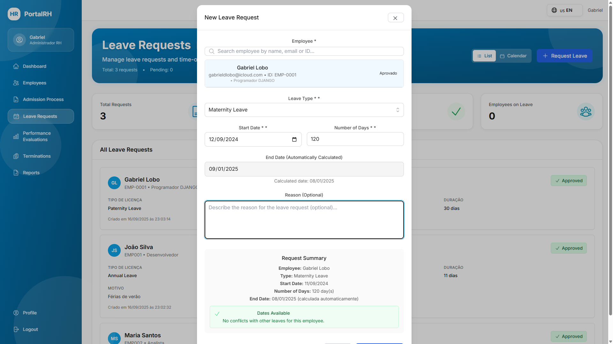
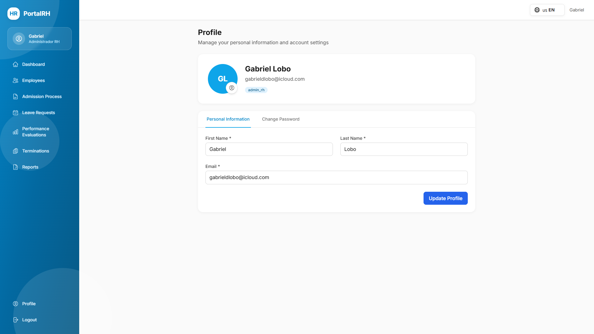

<!-- markdownlint-disable MD033 -->

# PortalRH — Human Resources Management System

A Django-based Human Resources Management System that centralizes employee lifecycle operations, including admissions, leave requests, evaluations, reports, and termination workflows.

## Documentation

Full project documentation is available at:
<a href="https://gabrieldlobo.github.io/01-PortalRH/" target="_blank" rel="noopener noreferrer">https://gabrieldlobo.github.io/01-PortalRH/</a>

### Local preview

```bash
mkdocs serve -a 127.0.0.1:8001
```

Open:
<a href="http://127.0.0.1:8001/" target="_blank" rel="noopener noreferrer">http://127.0.0.1:8001/</a>

### Docs source

Edit markdown pages in `docs/` and navigation in `mkdocs.yml`.

### Publish

```bash
mkdocs gh-deploy --clean
```

## Documentation Index

- <a href="https://gabrieldlobo.github.io/01-PortalRH/overview/" target="_blank" rel="noopener noreferrer">Overview</a>
- <a href="https://gabrieldlobo.github.io/01-PortalRH/prerequisites/" target="_blank" rel="noopener noreferrer">Prerequisites</a>
- <a href="https://gabrieldlobo.github.io/01-PortalRH/installation/" target="_blank" rel="noopener noreferrer">Installation</a>
- <a href="https://gabrieldlobo.github.io/01-PortalRH/configuration/" target="_blank" rel="noopener noreferrer">Configuration</a>
- <a href="https://gabrieldlobo.github.io/01-PortalRH/quick-start/" target="_blank" rel="noopener noreferrer">Quick Start</a>
- <a href="https://gabrieldlobo.github.io/01-PortalRH/guidelines/" target="_blank" rel="noopener noreferrer">Guidelines and Standards</a>
- <a href="https://gabrieldlobo.github.io/01-PortalRH/structure/" target="_blank" rel="noopener noreferrer">Project Structure</a>
- <a href="https://gabrieldlobo.github.io/01-PortalRH/development/" target="_blank" rel="noopener noreferrer">Development</a>
- <a href="https://gabrieldlobo.github.io/01-PortalRH/frontend/" target="_blank" rel="noopener noreferrer">Frontend</a>
- <a href="https://gabrieldlobo.github.io/01-PortalRH/testing/" target="_blank" rel="noopener noreferrer">Testing</a>
- <a href="https://gabrieldlobo.github.io/01-PortalRH/api-endpoints/" target="_blank" rel="noopener noreferrer">API Endpoints</a>
- <a href="https://gabrieldlobo.github.io/01-PortalRH/system-modeling/" target="_blank" rel="noopener noreferrer">System Modeling</a>
- <a href="https://gabrieldlobo.github.io/01-PortalRH/authentication/" target="_blank" rel="noopener noreferrer">Authentication and Security</a>
- <a href="https://gabrieldlobo.github.io/01-PortalRH/deployment/" target="_blank" rel="noopener noreferrer">Deployment</a>
- <a href="https://gabrieldlobo.github.io/01-PortalRH/contributing/" target="_blank" rel="noopener noreferrer">Contributing</a>
- <a href="https://gabrieldlobo.github.io/01-PortalRH/project-images/" target="_blank" rel="noopener noreferrer">Project Images</a>
- <a href="https://gabrieldlobo.github.io/01-PortalRH/release-notes/" target="_blank" rel="noopener noreferrer">Release Notes</a>

## Key Features

- Employee management with profile and document handling
- Leave request workflow and approvals
- Performance evaluation cycles and templates
- Admission and onboarding process support
- Termination workflow with document tracking
- Reporting services with export capabilities
- Role-based API authentication and authorization

## Tech Stack

- Backend: Django 5 + Django REST Framework
- Frontend: React 19 + TypeScript
- Database: SQLite (development) and PostgreSQL-ready
- Documentation: MkDocs + Material for MkDocs
- Infrastructure: Docker + Nginx

## Getting Started

### 1. Clone and use the existing virtual environment

```bash
git clone https://github.com/GabrielDLobo/01-PortalRH.git
cd 01-PortalRH
```

Activate the existing environment already used in this project:

```bash
venv\Scripts\activate
```

### 2. Install dependencies

```bash
pip install -r requirements.txt
cd frontend
npm install
cd ..
```

### 3. Apply database migrations

```bash
python manage.py migrate
```

### 4. Start backend and frontend

```bash
python manage.py runserver
```

In another terminal:

```bash
cd frontend
npm run dev
```

### 5. Start local documentation

```bash
mkdocs serve -a 127.0.0.1:8001
```

## Common Commands

```bash
python manage.py test
mkdocs build --clean
mkdocs gh-deploy --clean
```

## Support

- Documentation: <a href="https://gabrieldlobo.github.io/01-PortalRH/" target="_blank" rel="noopener noreferrer">PortalRH Docs</a>
- Issues: <a href="https://github.com/GabrielDLobo/01-PortalRH/issues" target="_blank" rel="noopener noreferrer">GitHub Issues</a>

## Project Images

All current interface components are listed in the documentation page below:

- <a href="https://gabrieldlobo.github.io/01-PortalRH/project-images/" target="_blank" rel="noopener noreferrer">Project Images Documentation Page</a>

### Component Gallery






