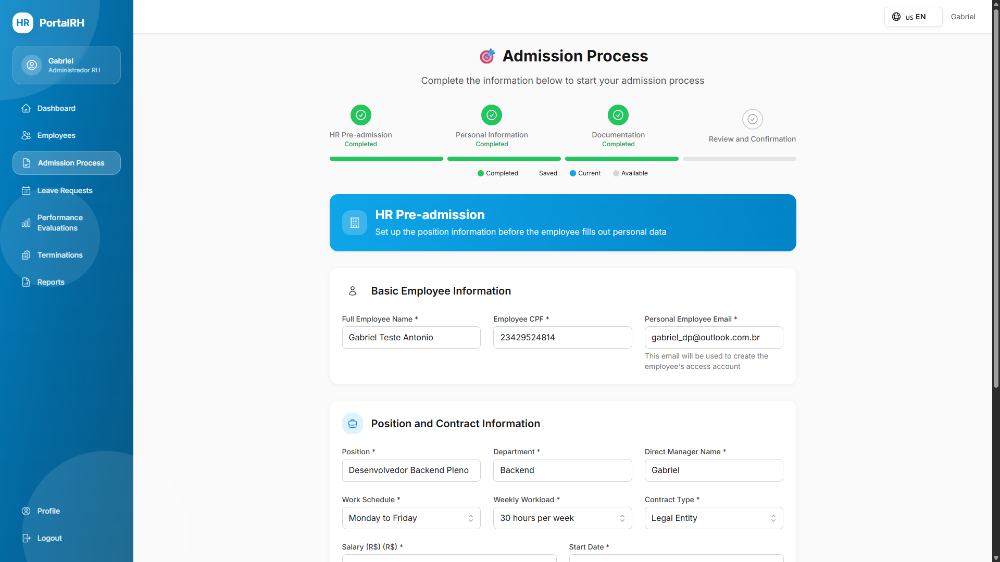
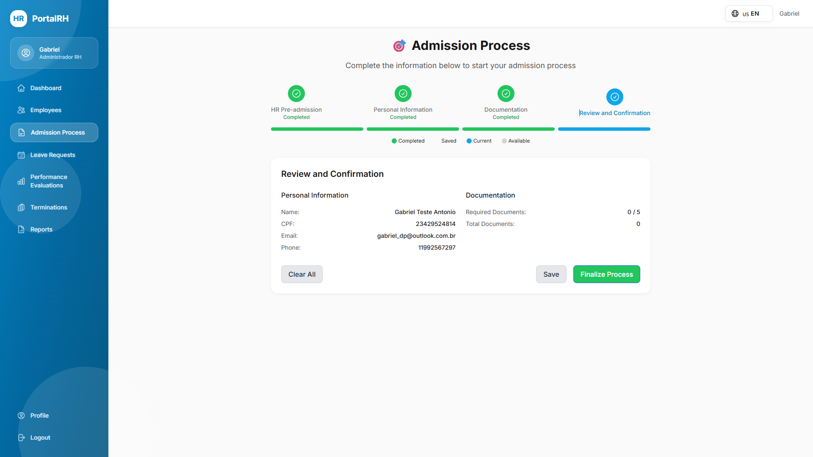
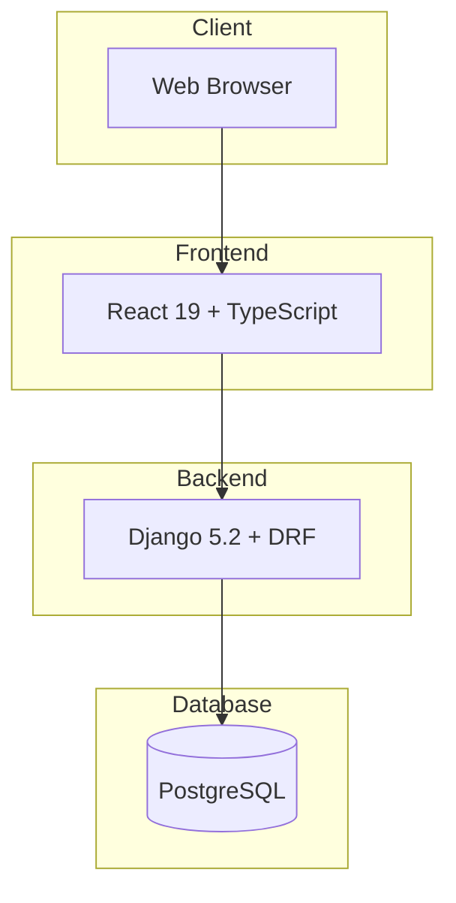

# PortalRH — Human Resources Management System

<div align="center">

[](LICENSE)
[](https://www.python.org/)
[](https://www.djangoproject.com/)
[](https://react.dev/)
[](https://www.typescriptlang.org/)

**A comprehensive HR Management System built with Django REST Framework and React + TypeScript**

[Documentation](https://gabrieldlobo.github.io/01-PortalRH/) | [API Docs](https://github.com/GabrielDLobo/01-PortalRH#-api-documentation) | [Report Bug](https://github.com/GabrielDLobo/01-PortalRH/issues)

</div>

---

## 📖 Documentation

**👉 For complete documentation, visit:**

### [📚 PortalRH Documentation Site](https://gabrieldlobo.github.io/01-PortalRH/)

The documentation includes:

- 🚀 [Quick Start Guide](https://gabrieldlobo.github.io/01-PortalRH/quick-start.html)
- 📦 [Installation Guide](https://gabrieldlobo.github.io/01-PortalRH/installation.html)
- ⚙️ [Configuration](https://gabrieldlobo.github.io/01-PortalRH/configuration.html)
- 📝 [API Reference](https://gabrieldlobo.github.io/01-PortalRH/api-endpoints.html)
- 🏗️ [System Architecture](https://gabrieldlobo.github.io/01-PortalRH/system-modeling.html)
- 🔐 [Security Guide](https://gabrieldlobo.github.io/01-PortalRH/authentication.html)
- 🧪 [Testing](https://gabrieldlobo.github.io/01-PortalRH/testing.html)
- 🚀 [Deployment](https://gabrieldlobo.github.io/01-PortalRH/deployment.html)
- 🤝 [Contributing](https://gabrieldlobo.github.io/01-PortalRH/contributing.html)

---

## 🎯 Quick Overview

PortalRH is a production-ready **Human Resources Management System** that provides:

| Feature | Description |
|---------|-------------|
| 👥 **Employee Management** | Complete profiles, documents, and admission tracking |
| 🏖️ **Leave Management** | Request workflow, balance tracking, approvals |
| 📊 **Performance Reviews** | Evaluations, templates, cycles, and 360° feedback |
| 📋 **Admission Process** | Pre-admission RH, onboarding, document verification |
| 🚪 **Termination** | Termination requests, approvals, and documentation |
| 📈 **Reports & Analytics** | Generate reports, export to PDF/Excel, scheduling |
| 👔 **Staff Management** | Department organization and hierarchy |

---

## 🛠️ Tech Stack

<div align="center">

| Backend | Frontend | Database | DevOps |
|---------|----------|----------|--------|
|  |  |  |  |
|  |  |  |  |

</div>

---

## 🚀 Quick Start

### Prerequisites

- Python 3.10+
- Node.js 18+
- PostgreSQL 15+ (optional for development)

### Installation

```bash
# Clone repository
git clone https://github.com/GabrielDLobo/01-PortalRH.git
cd 01-PortalRH

# Create virtual environment
python -m venv venv
source venv/bin/activate  # Linux/Mac
venv\Scripts\activate  # Windows

# Install dependencies
pip install -r requirements.txt
cd frontend && npm install && cd ..

# Configure environment
cp .env.example .env

# Run migrations
python manage.py migrate
python manage.py createsuperuser

# Start servers
python manage.py runserver  # Terminal 1
cd frontend && npm run dev  # Terminal 2
```

**👉 For detailed instructions, see the [Installation Guide](https://gabrieldlobo.github.io/01-PortalRH/installation.html)**

---

## 📁 Project Structure

```
01-PortalRH/
├── app/                 # Django project configuration
├── accounts/            # User authentication & authorization
├── employees/           # Employee management & documents
├── leave_requests/      # Leave request workflow
├── evaluations/         # Performance evaluations
├── termination/         # Termination management
├── staff/               # Staff & department management
├── reports/             # Reports & analytics
├── frontend/            # React TypeScript application
├── docs/                # Project documentation
├── media/               # User-uploaded files
└── docker-compose.yml   # Docker configuration
```

---

## 🔗 API Documentation

### Interactive API Docs

Once the backend is running, access:

- **Swagger UI:** http://localhost:8000/api/docs/
- **ReDoc:** http://localhost:8000/api/redoc/
- **OpenAPI Schema:** http://localhost:8000/api/schema/

### Main Endpoints

| Endpoint | Description |
|----------|-------------|
| `POST /api/v1/accounts/login/` | User authentication |
| `GET /api/v1/employees/` | List employees |
| `POST /api/v1/leave-requests/` | Submit leave request |
| `GET /api/v1/evaluations/` | List evaluations |
| `POST /api/v1/reports/templates/{id}/execute/` | Generate report |

**👉 For complete API reference, see [API Endpoints](https://gabrieldlobo.github.io/01-PortalRH/api-endpoints.html)**

---

## 📸 Screenshots

### Dashboard & Authentication

| Login | Dashboard |
|-------|-----------|
|  |  |

### Employee Management

| Employee List | Employee Detail |
|---------------|-----------------|
|  |  |

### Reports & Analytics

| Reports | Analytics |
|---------|-----------|
|  |  |

---

## 🏗️ System Architecture



**👉 For detailed architecture, see [System Modeling](https://gabrieldlobo.github.io/01-PortalRH/system-modeling.html)**

---

## 🔐 Security Features

- ✅ JWT-based authentication
- ✅ Role-based access control (RBAC)
- ✅ CORS protection
- ✅ CSRF protection
- ✅ Input validation
- ✅ Password hashing (PBKDF2)
- ✅ HTTPS support

**👉 For security details, see [Authentication Guide](https://gabrieldlobo.github.io/01-PortalRH/authentication.html)**

---

## 🧪 Testing

### Backend Tests

```bash
pytest
pytest --cov=app --cov-report=html
```

### Frontend Tests

```bash
cd frontend
npm test
npm test -- --coverage
```

**👉 For testing guide, see [Testing Documentation](https://gabrieldlobo.github.io/01-PortalRH/testing.html)**

---

## 🐳 Docker Deployment

```bash
# Start all services
docker compose up -d

# View logs
docker compose logs -f

# Run migrations
docker compose exec backend python manage.py migrate

# Create superuser
docker compose exec backend python manage.py createsuperuser
```

**👉 For deployment guide, see [Deployment Documentation](https://gabrieldlobo.github.io/01-PortalRH/deployment.html)**

---

## 🤝 Contributing

We welcome contributions! Please see our [Contributing Guide](https://gabrieldlobo.github.io/01-PortalRH/contributing.html) for details.

### Ways to Contribute

- 🐛 Report bugs
- ✨ Suggest features
- 📝 Improve documentation
- 💻 Submit pull requests
- 🧪 Write tests
- 💡 Share ideas

---

## 📋 License

This project is private and for internal use only.

---

## 👨‍💻 Author

**GabrielDLobo**

- GitHub: [@GabrielDLobo](https://github.com/GabrielDLobo)
- LinkedIn: [Gabriel D'Lobo](https://linkedin.com/in/gabrieldlobo)

---

## 📞 Support

- **Documentation:** [PortalRH Docs](https://gabrieldlobo.github.io/01-PortalRH/)
- **Issues:** [GitHub Issues](https://github.com/GabrielDLobo/01-PortalRH/issues)
- **API Docs:** `/api/docs/` or `/api/redoc/`

---

<div align="center">

**If you find this project helpful, please consider giving it a ⭐!**

[Back to top](#portalrh--human-resources-management-system)

</div>
