<!-- markdownlint-disable MD033 -->

# PortalRH — Human Resources Management System

[](https://github.com/GabrielDLobo/01-PortalRH/actions/workflows/ci.yml)

A Django-based Human Resources Management System that centralizes employee lifecycle operations, including admissions, leave requests, evaluations, reports, and termination workflows.

## Documentation

Full project documentation is available at:
<a href="https://gabrieldlobo.github.io/01-PortalRH/" target="_blank" rel="noopener noreferrer">https://gabrieldlobo.github.io/01-PortalRH/</a>

### Local preview

```bash
mkdocs serve -a 127.0.0.1:8001
```

Open:
<a href="http://127.0.0.1:8001/" target="_blank" rel="noopener noreferrer">http://127.0.0.1:8001/</a>

### Docs source

Edit markdown pages in `docs/` and navigation in `mkdocs.yml`.

### Publish

```bash
mkdocs gh-deploy --clean
```

## Documentation Index

- <a href="https://gabrieldlobo.github.io/01-PortalRH/overview/" target="_blank" rel="noopener noreferrer">Overview</a>
- <a href="https://gabrieldlobo.github.io/01-PortalRH/prerequisites/" target="_blank" rel="noopener noreferrer">Prerequisites</a>
- <a href="https://gabrieldlobo.github.io/01-PortalRH/installation/" target="_blank" rel="noopener noreferrer">Installation</a>
- <a href="https://gabrieldlobo.github.io/01-PortalRH/configuration/" target="_blank" rel="noopener noreferrer">Configuration</a>
- <a href="https://gabrieldlobo.github.io/01-PortalRH/quick-start/" target="_blank" rel="noopener noreferrer">Quick Start</a>
- <a href="https://gabrieldlobo.github.io/01-PortalRH/guidelines/" target="_blank" rel="noopener noreferrer">Guidelines and Standards</a>
- <a href="https://gabrieldlobo.github.io/01-PortalRH/structure/" target="_blank" rel="noopener noreferrer">Project Structure</a>
- <a href="https://gabrieldlobo.github.io/01-PortalRH/development/" target="_blank" rel="noopener noreferrer">Development</a>
- <a href="https://gabrieldlobo.github.io/01-PortalRH/frontend/" target="_blank" rel="noopener noreferrer">Frontend</a>
- <a href="https://gabrieldlobo.github.io/01-PortalRH/testing/" target="_blank" rel="noopener noreferrer">Testing</a>
- <a href="https://gabrieldlobo.github.io/01-PortalRH/api-endpoints/" target="_blank" rel="noopener noreferrer">API Endpoints</a>
- <a href="https://gabrieldlobo.github.io/01-PortalRH/system-modeling/" target="_blank" rel="noopener noreferrer">System Modeling</a>
- <a href="https://gabrieldlobo.github.io/01-PortalRH/authentication/" target="_blank" rel="noopener noreferrer">Authentication and Security</a>
- <a href="https://gabrieldlobo.github.io/01-PortalRH/deployment/" target="_blank" rel="noopener noreferrer">Deployment</a>
- <a href="https://gabrieldlobo.github.io/01-PortalRH/contributing/" target="_blank" rel="noopener noreferrer">Contributing</a>
- <a href="https://gabrieldlobo.github.io/01-PortalRH/project-images/" target="_blank" rel="noopener noreferrer">Project Images</a>
- <a href="https://gabrieldlobo.github.io/01-PortalRH/release-notes/" target="_blank" rel="noopener noreferrer">Release Notes</a>

## Key Features

- Employee management with profile and document handling
- Leave request workflow and approvals
- Performance evaluation cycles and templates
- Admission and onboarding process support
- Termination workflow with document tracking
- Reporting services with export capabilities
- Role-based API authentication and authorization

## Tech Stack

- Backend: Django 5 + Django REST Framework
- Frontend: React 19 + TypeScript
- Database: SQLite (development) and PostgreSQL-ready
- Documentation: MkDocs + Material for MkDocs
- Infrastructure: Docker + Nginx

## Getting Started

Backend setup, from a clean clone, in five commands (Windows):

```bash
git clone https://github.com/GabrielDLobo/01-PortalRH.git && cd 01-PortalRH
python -m venv venv && venv\Scripts\activate
pip install -r requirements.txt
python -c "import secrets; print(f'SECRET_KEY={secrets.token_urlsafe(50)}')" > .env
python manage.py migrate && python manage.py runserver
```

`SECRET_KEY` is required — the app will not start without it (see [Security](#security)).
For a real deployment, start from `.env.example` instead, which documents every
supported variable (database, email, CORS, etc.).

### Frontend (optional)

```bash
cd frontend
npm install
npm run dev
```

### Documentation site (optional)

```bash
pip install -r requirements-dev.txt
mkdocs serve -a 127.0.0.1:8001
```

## Common Commands

```bash
python manage.py test
ruff check . && ruff format --check .
bandit -r . -c pyproject.toml
pip-audit -r requirements.txt
mkdocs gh-deploy --clean
```

## Security

- `SECRET_KEY` is required from the environment; the app fails to start without it. `DEBUG` defaults to `False`.
- Login and token refresh are rate-limited; JWT refresh tokens rotate and are blacklisted on rotation.
- Permissions are enforced by role (HR vs. employee) at both the queryset and object level.
- Employee document uploads are checked against an extension whitelist, a size limit, and a content-signature match.
- `ruff`, `bandit`, and `pip-audit` run in CI on every push.
- Swagger (`/api/docs/`) and Redoc (`/api/redoc/`) are left public as a portfolio decision, so the API surface can be reviewed without authenticating.

Full details and how to report a vulnerability: [SECURITY.md](SECURITY.md).

## Support

- Documentation: <a href="https://gabrieldlobo.github.io/01-PortalRH/" target="_blank" rel="noopener noreferrer">PortalRH Docs</a>
- Issues: <a href="https://github.com/GabrielDLobo/01-PortalRH/issues" target="_blank" rel="noopener noreferrer">GitHub Issues</a>

## Project Images

All current interface components are listed in the documentation page below:

- <a href="https://gabrieldlobo.github.io/01-PortalRH/project-images/" target="_blank" rel="noopener noreferrer">Project Images Documentation Page</a>

### Component Gallery

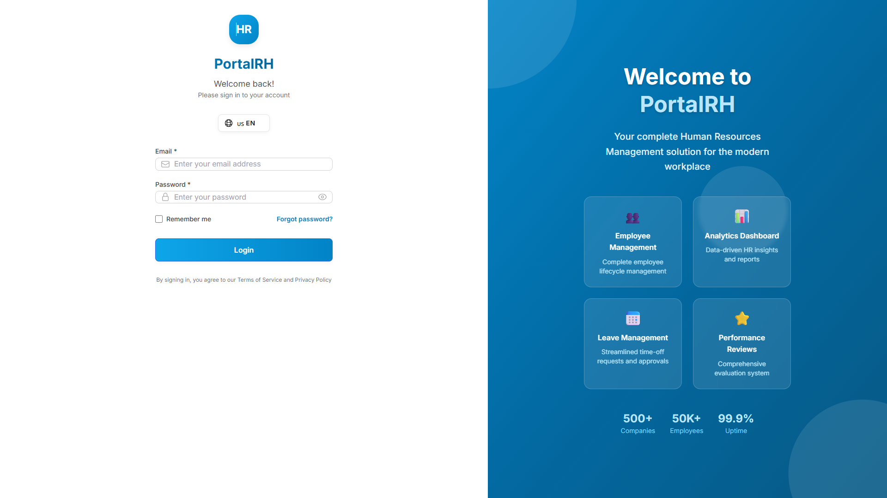
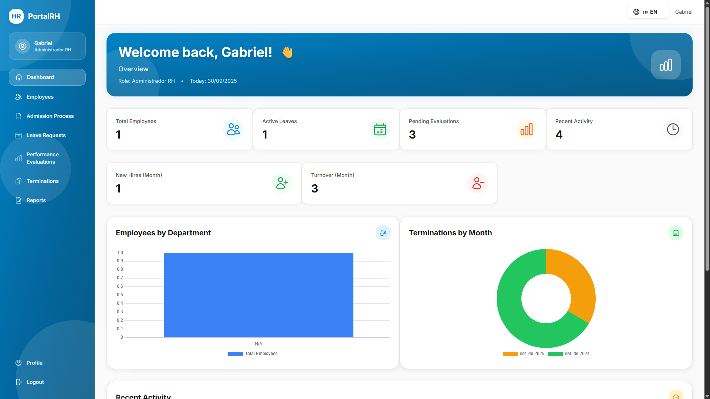
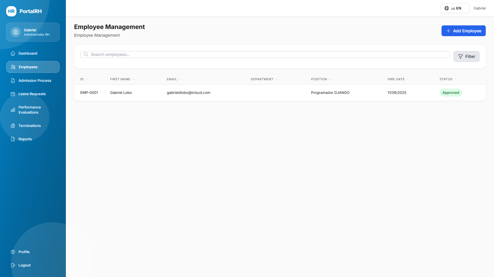
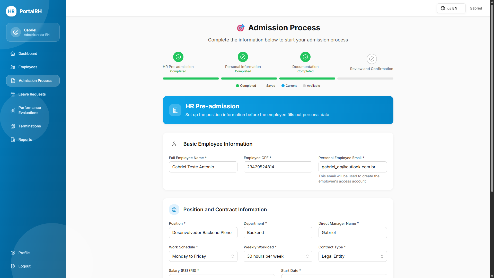
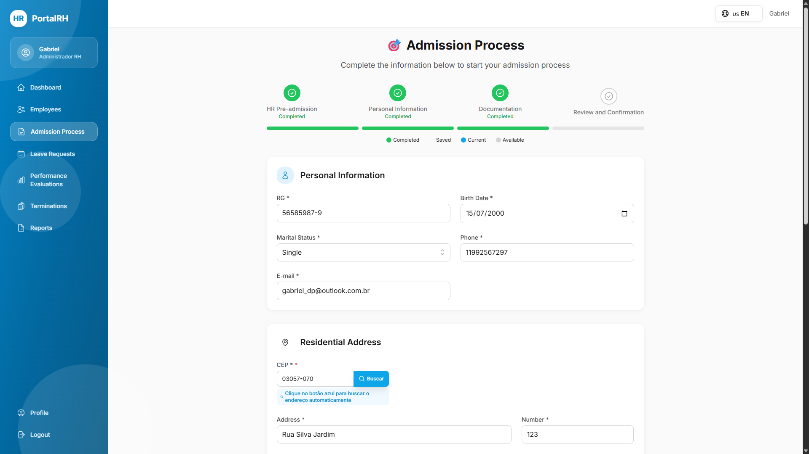
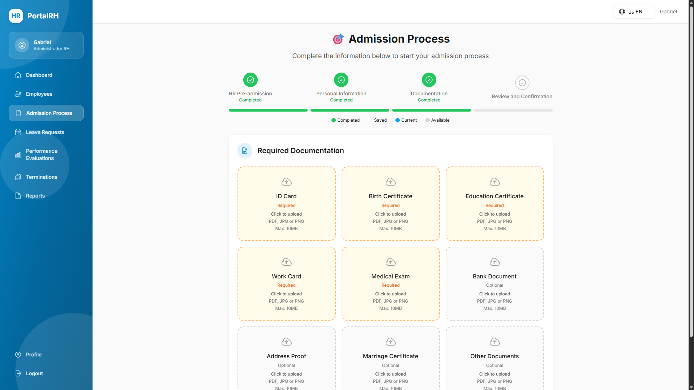
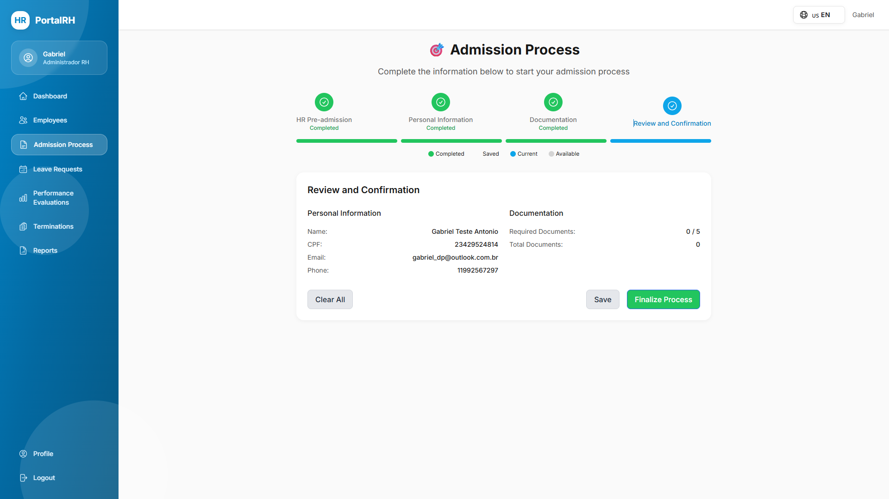
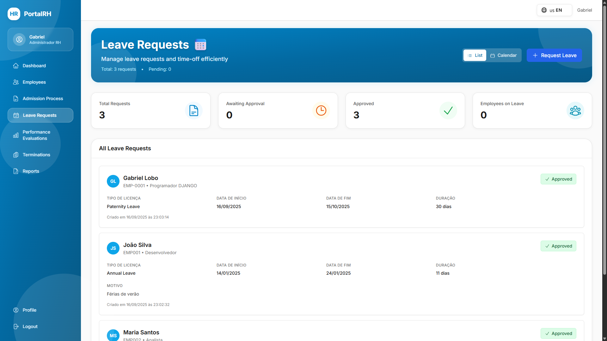
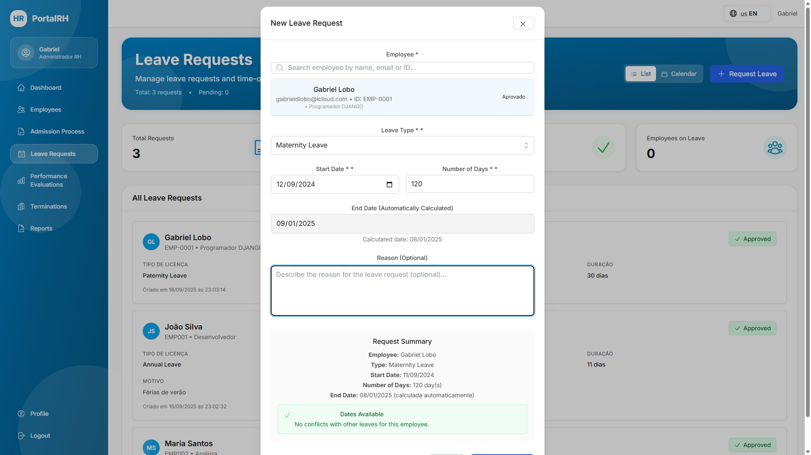
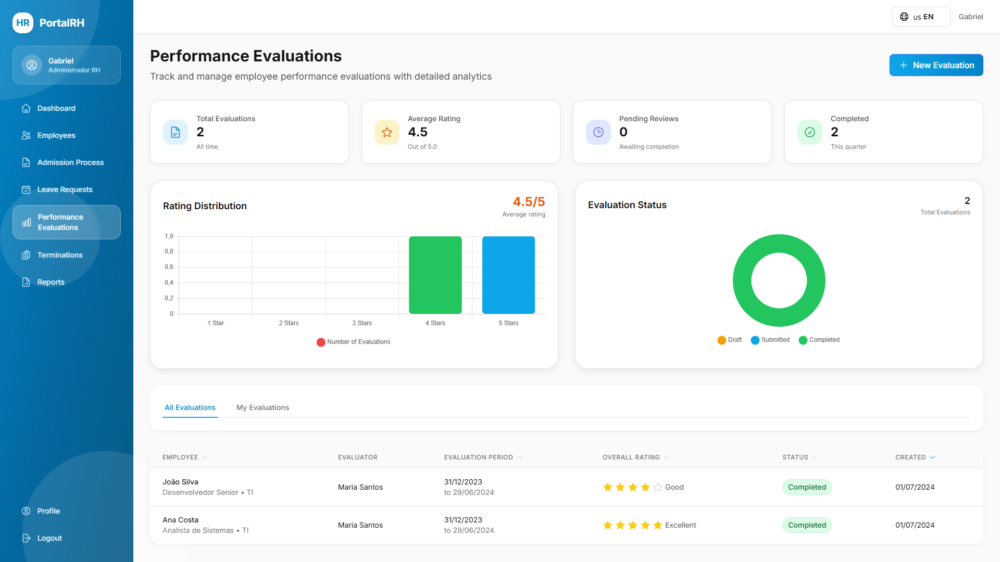
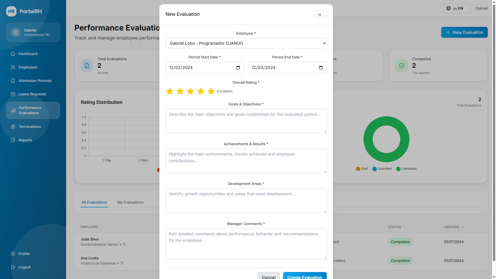
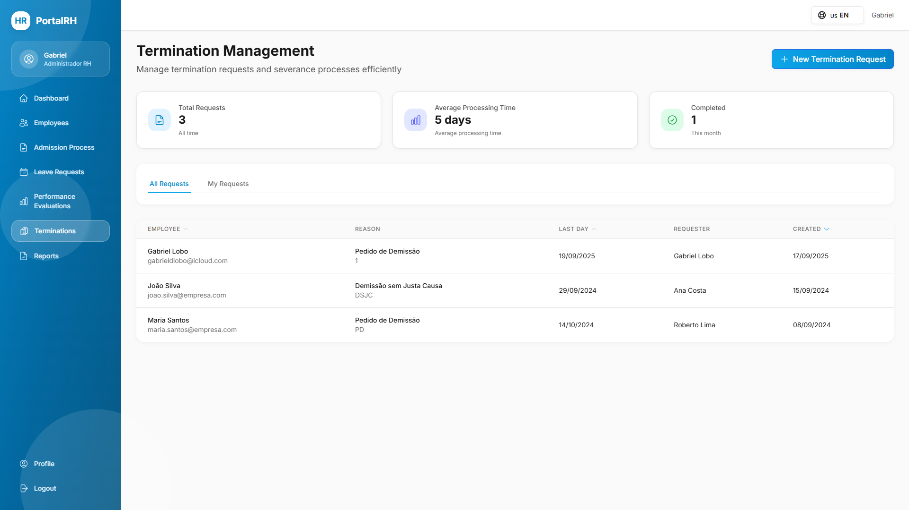
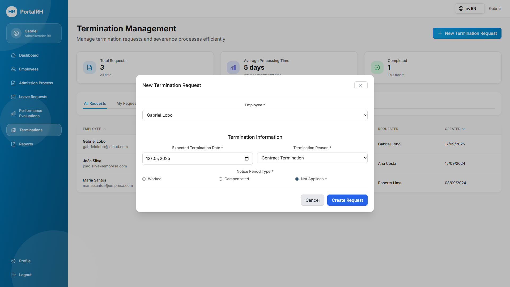
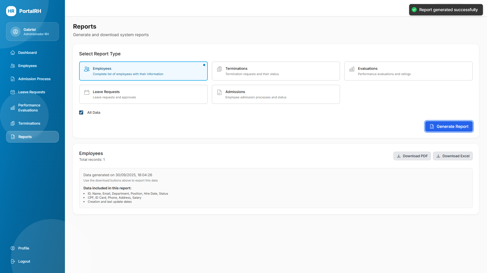
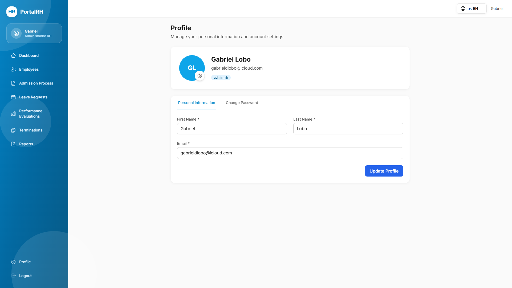
