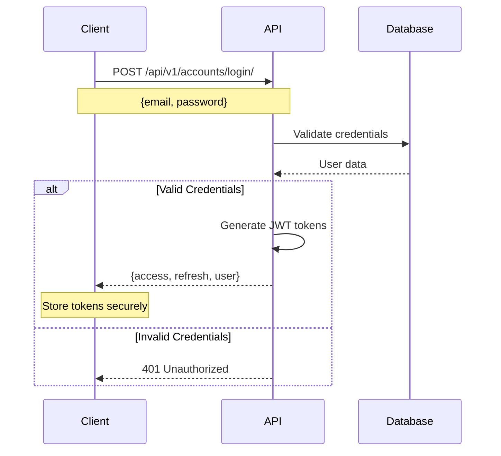
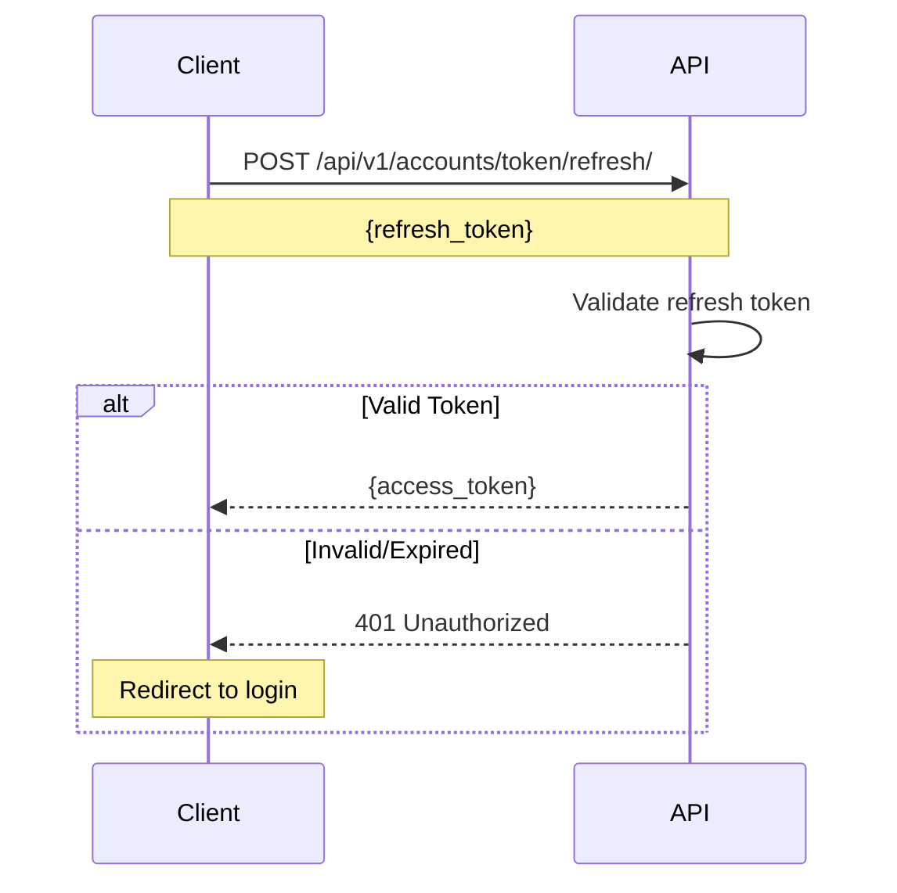
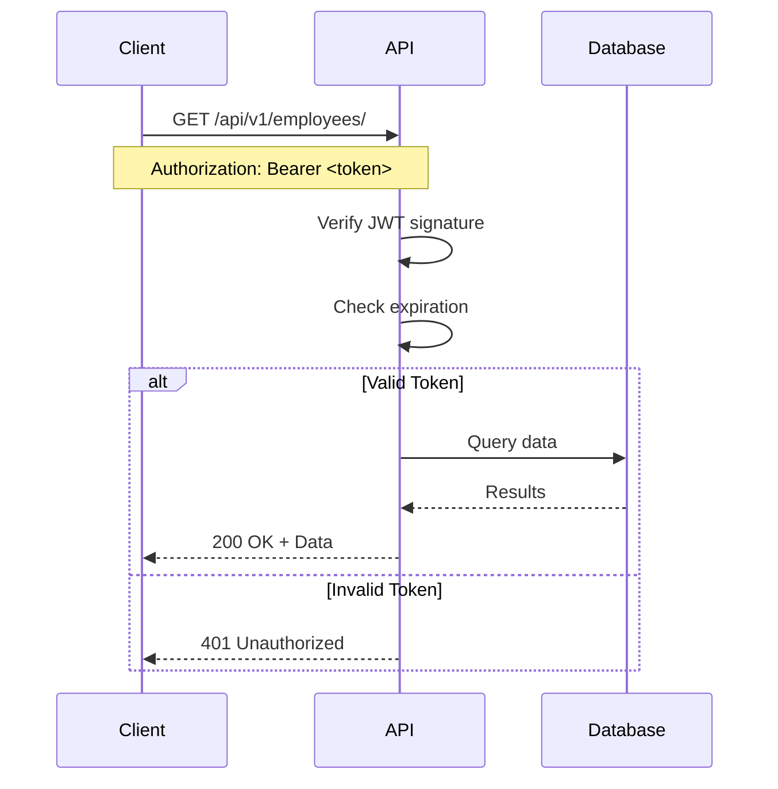
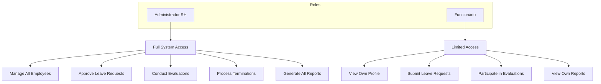

# Authentication and Security

This document covers authentication mechanisms, authorization, security measures, and best practices for PortalRH.

---

## 🔐 Overview

PortalRH implements a comprehensive security architecture including:

- **JWT-based Authentication** - Stateless token authentication
- **Role-Based Access Control (RBAC)** - Permission management
- **Input Validation** - Data sanitization
- **CORS Protection** - Cross-origin request control
- **CSRF Protection** - Request forgery prevention
- **Password Hashing** - Secure credential storage

---

## 🔑 Authentication System

### JWT Token Structure

PortalRH uses JSON Web Tokens (JWT) for authentication:

```
Header
{
  "alg": "HS256",
  "typ": "JWT"
}

Payload
{
  "token_type": "access",
  "exp": 1712000000,
  "iat": 1711998200,
  "jti": "unique-token-id",
  "user_id": 1,
  "email": "user@example.com"
}

Signature
HMACSHA256(base64(header) + "." + base64(payload), secret_key)
```

### Token Types

| Token Type | Lifetime | Purpose |
|------------|----------|---------|
| **Access Token** | 15 minutes | API authentication |
| **Refresh Token** | 7 days | Obtain new access tokens |

---

## 📝 Authentication Flow

### Login Process



### Token Refresh



### API Request with Authentication



---

## 👥 User Roles and Permissions

### Role Hierarchy



### Permission Matrix

| Feature | Admin RH | Funcionário |
|---------|----------|-------------|
| **View All Employees** | ✅ | ❌ |
| **View Own Profile** | ✅ | ✅ |
| **Create Employee** | ✅ | ❌ |
| **Edit Employee** | ✅ | Own only |
| **Delete Employee** | ✅ | ❌ |
| **Submit Leave Request** | ✅ | ✅ |
| **Approve Leave Request** | ✅ | ❌ |
| **Create Evaluation** | ✅ | ❌ |
| **Submit Evaluation** | ✅ | ✅ (self) |
| **Process Termination** | ✅ | ❌ |
| **Generate Reports** | All | Own only |

---

## 🛡️ Security Measures

### Password Security

**Hashing Algorithm:** PBKDF2 with SHA256

```python
# Django default settings
PASSWORD_HASHERS = [
    'django.contrib.auth.hashers.PBKDF2PasswordHasher',
]

PASSWORD_HASHERS_SETTINGS = {
    'iterations': 600000,  # Default for Django 5.2
    'salt': 'random-salt',
}
```

**Password Validators:**

```python
AUTH_PASSWORD_VALIDATORS = [
    {
        'NAME': 'django.contrib.auth.password_validation.UserAttributeSimilarityValidator',
    },
    {
        'NAME': 'django.contrib.auth.password_validation.MinimumLengthValidator',
        'OPTIONS': {'min_length': 8}
    },
    {
        'NAME': 'django.contrib.auth.password_validation.CommonPasswordValidator',
    },
    {
        'NAME': 'django.contrib.auth.password_validation.NumericPasswordValidator',
    },
]
```

### CORS Configuration

**Development:**
```python
CORS_ALLOWED_ORIGINS = [
    "http://localhost:3000",
]

CORS_ALLOW_CREDENTIALS = True
```

**Production:**
```python
CORS_ALLOWED_ORIGINS = [
    "https://portalrh.example.com",
]

CORS_ALLOW_HEADERS = [
    'accept',
    'authorization',
    'content-type',
    'user-agent',
    'x-csrftoken',
    'x-requested-with',
]
```

### CSRF Protection

```python
MIDDLEWARE = [
    'django.middleware.csrf.CsrfViewMiddleware',
    # ... other middleware
]

# For API endpoints using JWT
CSRF_TRUSTED_ORIGINS = [
    'https://portalrh.example.com',
]
```

---

## 🔒 API Security

### Authentication Classes

```python
REST_FRAMEWORK = {
    'DEFAULT_AUTHENTICATION_CLASSES': [
        'rest_framework_simplejwt.authentication.JWTAuthentication',
    ],
    'DEFAULT_PERMISSION_CLASSES': [
        'rest_framework.permissions.IsAuthenticated',
    ],
}
```

### Permission Classes

**Built-in Permissions:**

```python
from rest_framework.permissions import (
    IsAuthenticated,
    IsAdminUser,
    AllowAny,
    IsAuthenticatedOrReadOnly,
)
```

**Custom Permissions:**

```python
from rest_framework import permissions

class IsAdminRH(permissions.BasePermission):
    """
    Custom permission to allow only Admin RH users
    """
    
    def has_permission(self, request, view):
        return request.user.is_authenticated and request.user.is_admin_rh
    
    def has_object_permission(self, request, view, obj):
        return request.user.is_admin_rh


class IsOwnerOrAdminRH(permissions.BasePermission):
    """
    Custom permission to allow owners or Admin RH
    """
    
    def has_object_permission(self, request, view, obj):
        # Admin RH can access everything
        if request.user.is_admin_rh:
            return True
        
        # Check if user owns the object
        return hasattr(obj, 'user') and obj.user == request.user
```

### Usage in Views

```python
from rest_framework.decorators import permission_classes
from rest_framework.permissions import IsAuthenticated
from rest_framework.views import APIView

class EmployeeDetailView(APIView):
    permission_classes = [IsAuthenticated, IsOwnerOrAdminRH]
    
    def get(self, request, pk):
        # Only accessible by authenticated users
        # with appropriate permissions
        pass
```

---

## 📊 Input Validation

### Serializer Validation

```python
from rest_framework import serializers
from django.contrib.auth import get_user_model

User = get_user_model()

class EmployeeSerializer(serializers.ModelSerializer):
    email = serializers.EmailField(required=True)
    cpf = serializers.CharField(max_length=14, required=True)
    salary = serializers.DecimalField(
        max_digits=10,
        decimal_places=2,
        min_value=0
    )
    
    class Meta:
        model = Employee
        fields = ['id', 'email', 'cpf', 'full_name', 'salary']
    
    def validate_email(self, value):
        # Check email uniqueness
        if User.objects.filter(email=value).exists():
            raise serializers.ValidationError(
                "Email already registered"
            )
        return value.lower()
    
    def validate_cpf(self, value):
        # Validate CPF format
        if not self._is_valid_cpf(value):
            raise serializers.ValidationError(
                "Invalid CPF format"
            )
        return value
    
    def _is_valid_cpf(self, cpf: str) -> bool:
        # CPF validation logic
        pass
```

### Model Validation

```python
from django.core.exceptions import ValidationError
from django.db import models

class LeaveRequest(models.Model):
    # ... fields ...
    
    def clean(self):
        super().clean()
        
        # Validate dates
        if self.data_fim < self.data_inicio:
            raise ValidationError({
                'data_fim': 'End date must be after start date'
            })
        
        # Validate future dates
        if self.data_inicio < date.today():
            raise ValidationError({
                'data_inicio': 'Start date cannot be in the past'
            })
        
        # Validate leave balance
        if not self.can_request_leave():
            raise ValidationError({
                'tipo': 'Insufficient leave balance'
            })
```

---

## 🔐 Data Protection

### Sensitive Data Handling

**Never expose these fields in API responses:**

```python
class UserSerializer(serializers.ModelSerializer):
    class Meta:
        model = User
        fields = [
            'id',
            'email',
            'username',
            'first_name',
            'last_name',
            'role',
            # EXCLUDE: password, is_staff, is_superuser
        ]
        extra_kwargs = {
            'password': {'write_only': True},
        }
```

### File Upload Security

```python
class EmployeeDocumentSerializer(serializers.ModelSerializer):
    class Meta:
        model = EmployeeDocument
        fields = ['id', 'document_type', 'file', 'is_required']
    
    def validate_file(self, value):
        # Validate file size (max 10MB)
        max_size = 10 * 1024 * 1024  # 10MB
        if value.size > max_size:
            raise serializers.ValidationError(
                'File size cannot exceed 10MB'
            )
        
        # Validate file type
        allowed_types = [
            'application/pdf',
            'image/jpeg',
            'image/png',
        ]
        if value.content_type not in allowed_types:
            raise serializers.ValidationError(
                'Only PDF, JPEG, and PNG files are allowed'
            )
        
        return value
```

---

## 📋 Security Headers

### Nginx Configuration

```nginx
server {
    # Security headers
    add_header X-Frame-Options "SAMEORIGIN" always;
    add_header X-Content-Type-Options "nosniff" always;
    add_header X-XSS-Protection "1; mode=block" always;
    add_header Referrer-Policy "strict-origin-when-cross-origin" always;
    add_header Content-Security-Policy "default-src 'self'; script-src 'self' 'unsafe-inline'; style-src 'self' 'unsafe-inline';" always;
    
    # HTTPS redirect
    if ($scheme = http) {
        return 301 https://$server_name$request_uri;
    }
    
    # SSL configuration
    ssl_protocols TLSv1.2 TLSv1.3;
    ssl_ciphers HIGH:!aNULL:!MD5;
    ssl_prefer_server_ciphers on;
}
```

---

## 🔍 Audit Logging

### Activity Logging

```python
import logging

logger = logging.getLogger('security')

class SecurityAuditMiddleware:
    def __init__(self, get_response):
        self.get_response = get_response
    
    def __call__(self, request):
        response = self.get_response(request)
        
        # Log sensitive operations
        if request.method in ['POST', 'PUT', 'DELETE']:
            logger.info(
                f"User {request.user.email} performed {request.method} "
                f"on {request.path}"
            )
        
        return response
```

### Login Attempt Logging

```python
from django.contrib.auth import authenticate
from rest_framework_simplejwt.tokens import RefreshToken
import logging

logger = logging.getLogger('auth')

def login_user(email, password, request):
    user = authenticate(username=email, password=password)
    
    if user is not None:
        logger.info(f"Successful login: {email}")
        refresh = RefreshToken.for_user(user)
        return {
            'access': str(refresh.access_token),
            'refresh': str(refresh),
        }
    else:
        logger.warning(f"Failed login attempt: {email}")
        raise AuthenticationFailed('Invalid credentials')
```

---

## 🚨 Security Best Practices

### DO ✅

- Use HTTPS in production
- Rotate SECRET_KEY periodically
- Keep dependencies updated
- Implement rate limiting
- Log security events
- Use environment variables
- Validate all input
- Hash passwords properly
- Set secure cookie flags
- Implement token expiration

### DON'T ❌

- Hardcode credentials
- Log sensitive data
- Expose stack traces
- Use DEBUG=True in production
- Skip input validation
- Ignore security warnings
- Store tokens in localStorage (use httpOnly cookies)
- Trust client-side validation
- Use weak passwords
- Share SECRET_KEY

---

## 🔧 Security Configuration

### Django Settings

```python
# Security settings for production
DEBUG = False

SECURE_SSL_REDIRECT = True
SECURE_HSTS_SECONDS = 31536000  # 1 year
SECURE_HSTS_INCLUDE_SUBDOMAINS = True
SECURE_HSTS_PRELOAD = True

SESSION_COOKIE_SECURE = True
CSRF_COOKIE_SECURE = True
SESSION_COOKIE_HTTPONLY = True
CSRF_COOKIE_HTTPONLY = True

SECURE_CONTENT_TYPE_NOSNIFF = True
X_FRAME_OPTIONS = 'DENY'

# JWT Settings
from datetime import timedelta

SIMPLE_JWT = {
    'ACCESS_TOKEN_LIFETIME': timedelta(minutes=15),
    'REFRESH_TOKEN_LIFETIME': timedelta(days=7),
    'ROTATE_REFRESH_TOKENS': True,
    'BLACKLIST_AFTER_ROTATION': True,
    'ALGORITHM': 'HS256',
    'SIGNING_KEY': SECRET_KEY,
    'AUTH_HEADER_TYPES': ('Bearer',),
}
```

---

## 🧪 Security Testing

### Penetration Testing Checklist

- [ ] SQL Injection
- [ ] XSS (Cross-Site Scripting)
- [ ] CSRF (Cross-Site Request Forgery)
- [ ] Authentication bypass
- [ ] Authorization bypass
- [ ] Session fixation
- [ ] Token manipulation
- [ ] File upload vulnerabilities
- [ ] Directory traversal
- [ ] Information disclosure

### Automated Security Scanning

```bash
# Run security checks
pip install bandit
bandit -r app/

# Check for vulnerabilities
pip install safety
safety check

# Django security check
python manage.py check --deploy
```

---

## 📚 Related Documentation

- [API Endpoints](api-endpoints.md) - API reference
- [System Modeling](system-modeling.md) - Architecture diagrams
- [Development Guide](development.md) - Implementation guide

---

## 🆘 Security Incident Response

### If you discover a security vulnerability:

1. **DO NOT** disclose publicly
2. Email: security@portalrh.example.com
3. Include detailed description
4. Provide reproduction steps
5. Allow time for patching

### Response Timeline

- **Acknowledgment:** Within 24 hours
- **Assessment:** Within 72 hours
- **Patch:** Within 7 days
- **Disclosure:** After fix is deployed

---

## 📖 Resources

- [Django Security](https://docs.djangoproject.com/en/stable/topics/security/)
- [OWASP Top 10](https://owasp.org/www-project-top-ten/)
- [JWT Best Practices](https://tools.ietf.org/html/rfc8725)
- [REST API Security](https://restfulapi.net/security-essentials/)
