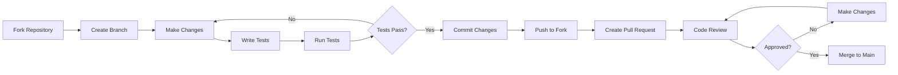

# Contributing

Thank you for your interest in contributing to PortalRH! This document provides guidelines and instructions for contributing to the project.

---

## 📋 Table of Contents

- [Code of Conduct](#code-of-conduct)
- [Getting Started](#getting-started)
- [How to Contribute](#how-to-contribute)
- [Pull Request Guidelines](#pull-request-guidelines)
- [Coding Standards](#coding-standards)
- [Commit Guidelines](#commit-guidelines)
- [Issue Reporting](#issue-reporting)

---

## 🤝 Code of Conduct

### Our Pledge

We pledge to make participation in our project a harassment-free experience for everyone. We welcome contributors of all backgrounds and identities.

### Our Standards

Examples of behavior that contributes to creating a positive environment:

- Using welcoming and inclusive language
- Being respectful of differing viewpoints
- Gracefully accepting constructive criticism
- Focusing on what is best for the community
- Showing empathy towards other community members

### Enforcement

Instances of abusive, harassing, or otherwise unacceptable behavior may be reported by contacting the project maintainers.

---

## 🚀 Getting Started

### 1. Fork the Repository

```bash
# Click "Fork" on GitHub to create your copy
# Then clone your fork
git clone https://github.com/YOUR_USERNAME/01-PortalRH.git
cd 01-PortalRH
```

### 2. Set Up Development Environment

```bash
# Create virtual environment
python -m venv venv
source venv/bin/activate  # Linux/macOS
venv\Scripts\activate     # Windows

# Install dependencies
pip install -r requirements.txt

# Configure environment
cp .env.example .env

# Run migrations
python manage.py migrate
```

### 3. Create a Branch

```bash
# Ensure you're on main branch
git checkout main

# Pull latest changes
git pull origin main

# Create feature branch
git checkout -b feature/your-feature-name
```

---

## 📝 How to Contribute

### Types of Contributions

| Type | Description |
|------|-------------|
| **Features** | New functionality |
| **Bug Fixes** | Fixing existing issues |
| **Documentation** | Improving docs, comments |
| **Tests** | Adding test coverage |
| **Refactoring** | Code improvements |
| **Performance** | Optimization |

### Contribution Process



---

## 🔄 Pull Request Guidelines

### Before Submitting

- [ ] Code follows style guide
- [ ] Tests are written and passing
- [ ] Documentation is updated
- [ ] No console.log or debug statements
- [ ] No hardcoded values
- [ ] Error handling is adequate
- [ ] Security considerations addressed

### PR Template

```markdown
## Description
Brief description of changes

## Type of Change
- [ ] Bug fix
- [ ] New feature
- [ ] Breaking change
- [ ] Documentation update

## Testing
- [ ] Tests added/updated
- [ ] All tests passing
- [ ] Manual testing completed

## Checklist
- [ ] Code follows project guidelines
- [ ] Self-review completed
- [ ] Comments added where necessary
- [ ] Documentation updated
```

### PR Title Format

```
<type>(<scope>): <description>

Examples:
feat(employees): add document verification
fix(auth): resolve token refresh issue
docs(api): update endpoint documentation
```

---

## 📐 Coding Standards

### Python Style

Follow PEP 8 with these specifics:

```python
# Imports
from django.db import models
from rest_framework import serializers

# Constants
MAX_FILE_SIZE = 10 * 1024 * 1024

# Classes
class EmployeeSerializer(serializers.ModelSerializer):
    """Docstring."""
    
    def validate_email(self, value):
        """Validate email."""
        return value

# Line length: max 100 characters
# Use type hints where appropriate
```

### Django Conventions

```python
# Models
class Employee(models.Model):
    """Employee model."""
    
    class Meta:
        verbose_name = 'Employee'
        verbose_name_plural = 'Employees'
        ordering = ['full_name']
    
    def __str__(self):
        return self.full_name
    
    @property
    def is_active(self):
        """Check if active."""
        return self.status == 'active'

# Views
class EmployeeViewSet(viewsets.ModelViewSet):
    """Employee viewset."""
    queryset = Employee.objects.all()
    serializer_class = EmployeeSerializer
```

### Documentation

Use Google-style docstrings:

```python
def calculate_leave_balance(employee, year):
    """
    Calculate available leave days.
    
    Args:
        employee (Employee): Employee instance
        year (int): Year to calculate
    
    Returns:
        int: Available days
    
    Raises:
        ValueError: If year is invalid
    """
    pass
```

---

## 💬 Commit Guidelines

### Conventional Commits

Follow the [Conventional Commits](https://www.conventionalcommits.org/) specification:

```
<type>(<scope>): <description>

[optional body]

[optional footer]
```

### Types

| Type | Description |
|------|-------------|
| `feat` | New feature |
| `fix` | Bug fix |
| `docs` | Documentation |
| `style` | Formatting |
| `refactor` | Code restructuring |
| `test` | Tests |
| `chore` | Maintenance |

### Examples

```bash
# Feature
git commit -m "feat(employees): add CPF validation"

# Bug fix
git commit -m "fix(auth): resolve JWT expiration issue"

# Documentation
git commit -m "docs(api): update leave request endpoints"

# Refactor
git commit -m "refactor(reports): extract query logic to service"

# Multiple lines
git commit -m "feat(leave): add balance tracking

- Add LeaveBalance model
- Implement balance calculation
- Add balance API endpoints

Closes #123"
```

---

## 🐛 Issue Reporting

### Bug Reports

Use the bug report template:

```markdown
## Bug Description
Clear description of the bug

## To Reproduce
Steps to reproduce:
1. Go to '...'
2. Click on '...'
3. See error

## Expected Behavior
What should happen

## Screenshots
If applicable

## Environment
- OS: [e.g., Windows 10]
- Python: [e.g., 3.10]
- Browser: [e.g., Chrome 100]

## Additional Context
Any other relevant information
```

### Feature Requests

```markdown
## Problem Statement
What problem does this solve?

## Proposed Solution
How should it work?

## Alternatives Considered
Other approaches

## Additional Context
Mockups, examples, etc.
```

---

## 🧪 Testing Requirements

### Before Submitting PR

```bash
# Run all tests
pytest

# Run with coverage
pytest --cov=.

# Check code style
black . --check
flake8
pylint accounts employees

# Run specific tests
pytest employees/tests/test_models.py
```

### Test Coverage

Minimum coverage requirements:

| Component | Coverage |
|-----------|----------|
| Models | 90% |
| Serializers | 85% |
| Views | 80% |
| Permissions | 95% |

---

## 📚 Documentation

### What to Document

- New features and endpoints
- Configuration options
- Breaking changes
- Migration guides
- API changes

### Documentation Style

```markdown
# Feature Name

Brief description

## Usage

```python
# Example code
```

## Parameters

| Parameter | Type | Description |
|-----------|------|-------------|
| `name` | str | Description |

## Examples

```python
# Working example
```
```

---

## 🔍 Code Review Process

### Reviewer Checklist

- [ ] Code follows style guide
- [ ] Tests are adequate
- [ ] Documentation is complete
- [ ] No security issues
- [ ] Performance is acceptable
- [ ] Error handling is proper

### Review Response Time

- **Bug fixes:** 24-48 hours
- **Features:** 3-5 days
- **Documentation:** 2-3 days

### Addressing Feedback

```bash
# Make requested changes
# Commit with fixup or regular commit
git commit -m "fix: address review comments"

# Push to same branch
git push origin feature/your-feature

# PR updates automatically
```

---

## 🌟 Recognition

Contributors are recognized in:

- README.md contributors section
- Release notes
- Annual contributor highlights

---

## 📞 Getting Help

### Communication Channels

- **GitHub Issues:** For bug reports and feature requests
- **GitHub Discussions:** For questions and discussions
- **Email:** For security issues

### Resources

- [Documentation](./index.md)
- [API Reference](./api-endpoints.md)
- [Development Guide](./development.md)

---

## 🏆 Top Contributions

We welcome all types of contributions:

| Contribution | Impact |
|--------------|--------|
| Bug fixes | High |
| New features | High |
| Documentation | Medium |
| Tests | Medium |
| Code review | Medium |
| Community help | Medium |

---

## 📜 License

By contributing, you agree that your contributions will be licensed under the project's license.

---

Thank you for contributing to PortalRH! 🎉

**Next:** [Release Notes](release-notes.md)
