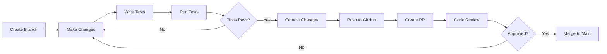

# Contributing Guide

Thank you for your interest in contributing to PortalRH! This guide provides guidelines and instructions for contributing to the project.

---

## 📋 Table of Contents

- [Code of Conduct](#code-of-conduct)
- [Getting Started](#getting-started)
- [How to Contribute](#how-to-contribute)
- [Pull Request Guidelines](#pull-request-guidelines)
- [Coding Standards](#coding-standards)
- [Issue Reporting](#issue-reporting)
- [Development Workflow](#development-workflow)
- [Recognition](#recognition)

---

## 🤝 Code of Conduct

### Our Pledge

We pledge to make participation in PortalRH a harassment-free experience for everyone. We welcome contributors of all backgrounds and experience levels.

### Expected Behavior

- Be respectful and inclusive
- Accept constructive criticism
- Focus on what is best for the community
- Show empathy towards others

### Unacceptable Behavior

- Harassment or discrimination
- Offensive comments
- Trolling or insulting
- Publishing others' private information

---

## 🚀 Getting Started

### 1. Fork the Repository

```bash
# Click "Fork" on GitHub to create your copy
# Then clone your fork
git clone https://github.com/YOUR_USERNAME/01-PortalRH.git
cd 01-PortalRH
```

### 2. Set Up Development Environment

```bash
# Create virtual environment
python -m venv venv
source venv/bin/activate  # Linux/Mac
venv\Scripts\activate  # Windows

# Install dependencies
pip install -r requirements.txt

# Install pre-commit hooks (optional)
pip install pre-commit
pre-commit install
```

### 3. Create a Branch

```bash
# Sync with upstream
git remote add upstream https://github.com/GabrielDLobo/01-PortalRH.git
git fetch upstream
git checkout main
git merge upstream/main

# Create feature branch
git checkout -b feature/your-feature-name
```

---

## 📝 How to Contribute

### Types of Contributions

#### 1. Bug Fixes

- Find an issue labeled "bug"
- Create a branch: `fix/description-of-fix`
- Write tests to reproduce the bug
- Submit PR with fix

#### 2. New Features

- Check if feature aligns with project goals
- Create issue to discuss feature
- Create branch: `feature/description`
- Implement feature with tests
- Submit PR

#### 3. Documentation

- Improve existing documentation
- Add missing documentation
- Fix typos and clarifications
- Create branch: `docs/description`

#### 4. Code Quality

- Refactor code
- Improve performance
- Add tests
- Create branch: `refactor/description`

#### 5. Testing

- Add missing test coverage
- Fix flaky tests
- Improve test infrastructure
- Create branch: `test/description`

---

## 🔀 Pull Request Guidelines

### PR Checklist

Before submitting your PR, ensure:

- [ ] Code follows style guidelines
- [ ] Tests are included for new features
- [ ] All tests pass
- [ ] Documentation is updated
- [ ] Commit messages follow conventions
- [ ] Branch is up to date with main
- [ ] No sensitive data is committed

### PR Template

```markdown
## Description
Brief description of changes

## Type of Change
- [ ] Bug fix
- [ ] New feature
- [ ] Breaking change
- [ ] Documentation update

## Testing
Describe testing performed:
- [ ] Unit tests added/updated
- [ ] Integration tests added/updated
- [ ] Manual testing performed

## Checklist
- [ ] Code follows project guidelines
- [ ] Self-review completed
- [ ] Comments added where necessary
- [ ] Documentation updated

## Related Issues
Closes #123
```

### PR Process



---

## 📏 Coding Standards

### Python Guidelines

**Follow PEP 8:**

```python
# Good
def calculate_salary(base: Decimal, bonus: Decimal = None) -> Decimal:
    """Calculate final salary."""
    if bonus is None:
        bonus = Decimal('0')
    return base + bonus

# Bad
def calcSal(b,b2=0):  # Bad naming, no types
    return b+b2  # No docstring
```

**Type Hints:**

```python
from typing import Optional, List, Dict

def process_employees(
    ids: List[int],
    options: Optional[Dict[str, str]] = None
) -> List[Employee]:
    """Process multiple employees."""
    pass
```

**Docstrings:**

```python
def approve_leave_request(
    request_id: int,
    approver: User,
    comments: str = ''
) -> LeaveRequest:
    """
    Approve a leave request.
    
    Args:
        request_id: ID of leave request
        approver: User approving
        comments: Optional comments
    
    Returns:
        Updated LeaveRequest
    
    Raises:
        ValidationError: If approval fails
    """
    pass
```

### TypeScript/React Guidelines

**Component Structure:**

```typescript
import React, { useState, useEffect } from 'react';

interface Props {
  title: string;
  count?: number;
}

export const Component: React.FC<Props> = ({ title, count = 0 }) => {
  // Hooks first
  const [state, setState] = useState(0);
  
  // Effects
  useEffect(() => {
    // Logic
  }, []);
  
  // Handlers
  const handleClick = () => {
    // Logic
  };
  
  // Render
  return <div>{title}</div>;
};
```

**Error Handling:**

```typescript
try {
  await api.get('/employees');
} catch (error) {
  if (error instanceof AxiosError) {
    console.error('API Error:', error.message);
  } else {
    console.error('Unknown error:', error);
  }
}
```

---

## 🐛 Issue Reporting

### Bug Report Template

```markdown
## Bug Description
Clear description of the bug

## Reproduction Steps
1. Go to '...'
2. Click on '...'
3. See error

## Expected Behavior
What should happen

## Actual Behavior
What actually happens

## Environment
- OS: [e.g., Windows 11]
- Browser: [e.g., Chrome 120]
- Version: [e.g., 1.0.0]

## Screenshots
If applicable

## Additional Context
Any other details
```

### Feature Request Template

```markdown
## Problem Statement
What problem does this solve?

## Proposed Solution
How should it work?

## Alternatives Considered
Other solutions you've thought about

## Use Cases
Who will use this feature?

## Additional Context
Mockups, examples, etc.
```

---

## 🌿 Development Workflow

### Branch Naming

```bash
# Features
feature/employee-crud
feature/add-search-filter

# Bug fixes
fix/login-error-handling
fix/leave-balance-calculation

# Documentation
docs/api-documentation
docs/readme-update

# Tests
test/add-employee-tests
test/integration-workflow

# Refactoring
refactor/auth-module
refactor/api-structure
```

### Commit Messages

Follow [Conventional Commits](https://www.conventionalcommits.org/):

```bash
# Format
<type>(<scope>): <description>

# Examples
feat(employees): add document upload endpoint
fix(leave-requests): correct balance calculation
docs(api): update authentication docs
refactor(auth): simplify token refresh
test(employees): add model unit tests
chore(deps): update django version
```

### Types

| Type | Description |
|------|-------------|
| `feat` | New feature |
| `fix` | Bug fix |
| `docs` | Documentation |
| `style` | Formatting |
| `refactor` | Code restructuring |
| `test` | Tests |
| `chore` | Maintenance |
| `perf` | Performance |

---

## 🧪 Testing Requirements

### Backend Tests

```python
# tests/test_feature.py
import pytest

@pytest.mark.django_db
class TestNewFeature:
    
    def test_feature_works(self, user):
        """Test that feature works as expected"""
        result = do_something(user)
        assert result is True
    
    def test_feature_handles_error(self, user):
        """Test error handling"""
        with pytest.raises(ValueError):
            do_something_invalid(user)
```

### Frontend Tests

```typescript
// Component.test.tsx
import { render, screen } from '@testing-library/react';

describe('Component', () => {
  it('renders correctly', () => {
    render(<Component title="Test" />);
    expect(screen.getByText('Test')).toBeInTheDocument();
  });
});
```

### Running Tests

```bash
# Backend
pytest
pytest --cov=app

# Frontend
cd frontend
npm test
npm test -- --coverage
```

---

## 📚 Documentation

### Code Comments

```python
# Good - explains why
# Using select_related to avoid N+1 queries
employees = Employee.objects.select_related('user').all()

# Bad - states the obvious
# Get all employees
employees = Employee.objects.all()
```

### README Updates

When adding new features:

1. Update feature list
2. Add configuration options
3. Update API documentation
4. Add usage examples

---

## 🎯 Recognition

### Contributors

Contributors will be recognized in:

- README.md contributors section
- Release notes
- Annual contributor highlights

### Becoming a Maintainer

Active contributors may be invited to become maintainers:

- Consistent contributions
- Quality code
- Helpful in reviews
- Community involvement

---

## 📞 Communication

### Getting Help

- **GitHub Issues:** For bugs and feature requests
- **Discussions:** For questions and ideas
- **Email:** For security issues

### Response Time

- Issues: Within 48 hours
- PRs: Within 1 week
- Questions: Within 48 hours

---

## ⚖️ Legal

### License

By contributing, you agree that your contributions will be licensed under the project's license.

### Copyright

All contributions are subject to the project's copyright.

---

## 📊 Contribution Stats

### Where to Contribute

| Area | Help Needed |
|------|-------------|
| **Backend** | API endpoints, tests, optimization |
| **Frontend** | Components, UX improvements |
| **Documentation** | Guides, API docs, examples |
| **Testing** | Unit tests, integration tests |
| **DevOps** | CI/CD, deployment scripts |

### Difficulty Levels

| Level | Description | Good For |
|-------|-------------|----------|
| 🟢 Easy | Small changes, docs | Beginners |
| 🟡 Medium | Features, refactoring | Intermediate |
| 🔴 Hard | Architecture, optimization | Advanced |

---

## 🙏 Thank You!

Your contributions make PortalRH better for everyone. We appreciate your time and effort!

---

## 📚 Related Documentation

- [Development Guide](development.md) - Development setup
- [Guidelines](guidelines.md) - Coding standards
- [Testing Guide](testing.md) - Testing requirements

---

## 🔗 Resources

- [First Contributions Guide](https://github.com/firstcontributions/first-contributions)
- [How to Contribute to Open Source](https://opensource.guide/how-to-contribute/)
- [Conventional Commits](https://www.conventionalcommits.org/)
- [GitHub Flow](https://guides.github.com/introduction/flow/)
