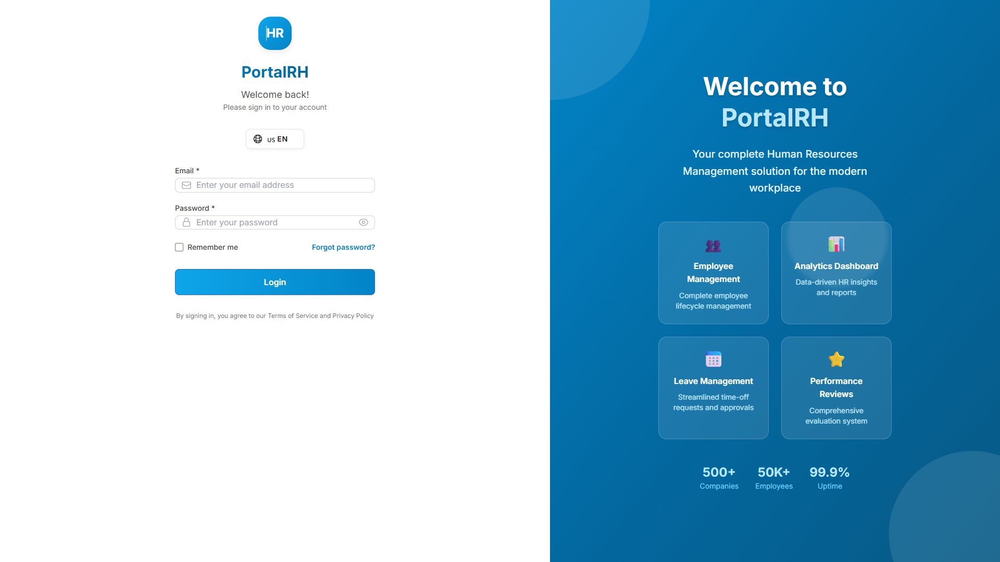
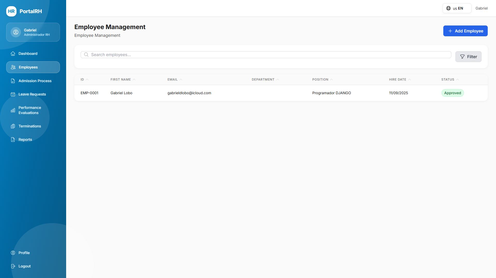
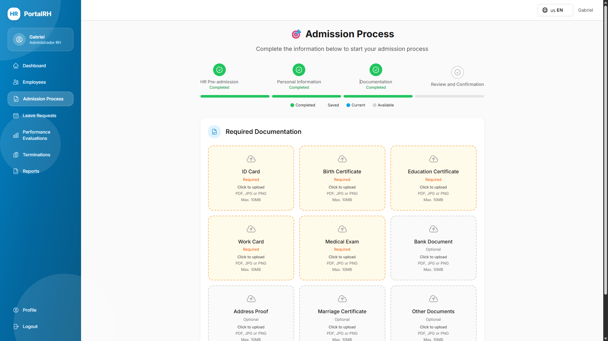
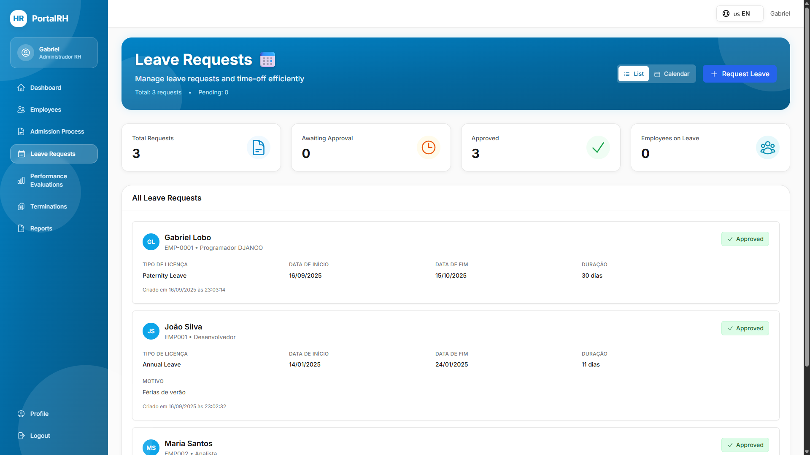
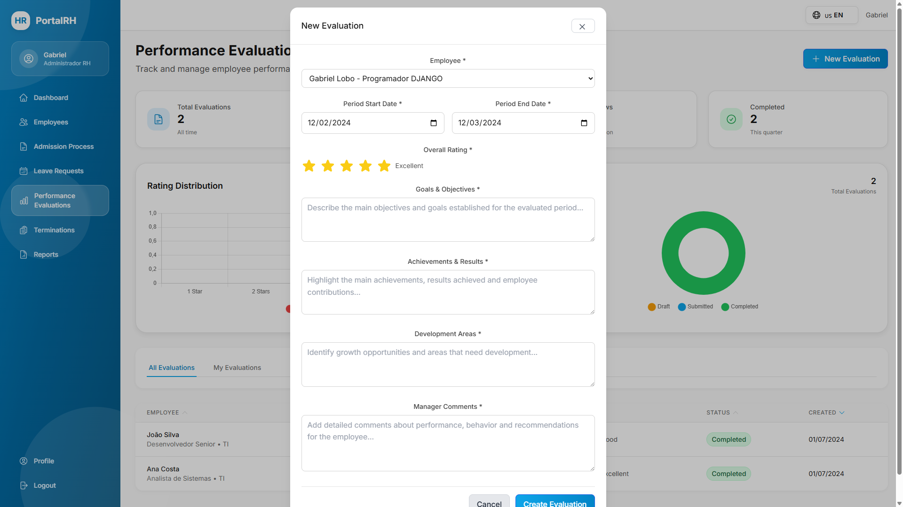
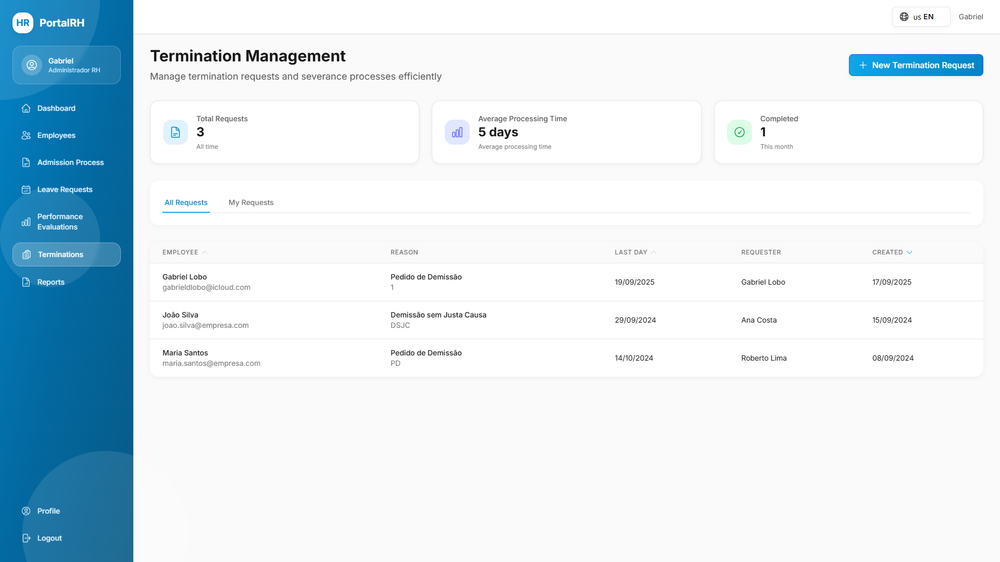
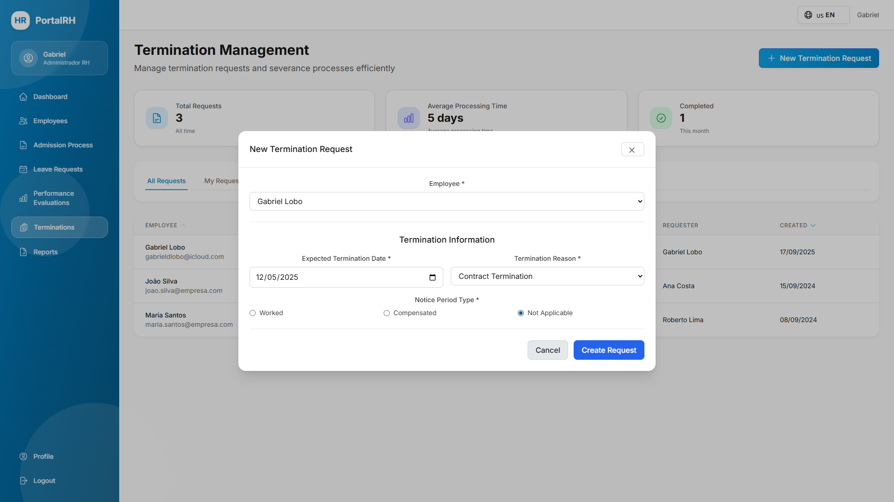

# Project Gallery

This page showcases snapshots of the **PortalRH** (Portal RH) application, demonstrating the user interface, features, and overall design of the system.

## System Screenshots

### Dashboard & Home

### Employee Management

### Reports & Analytics

### Administration & Configuration

### Additional Features

## Key Features Highlighted

- **Modern Dashboard**: Intuitive interface for quick access to key metrics
- **Employee Management**: Complete employee profile and document management
- **Leave Management**: Streamlined leave request and approval workflow
- **Reports**: Comprehensive reporting and analytics capabilities
- **Staff Management**: Team and department organization
- **Performance Evaluations**: Structured evaluation system
- **Secure Authentication**: Role-based access control and security
- **Responsive Design**: Mobile-friendly interface across all screens

---

For more information about the system, see the [Project Overview](overview.md) or [API Endpoints](api-endpoints.md).
