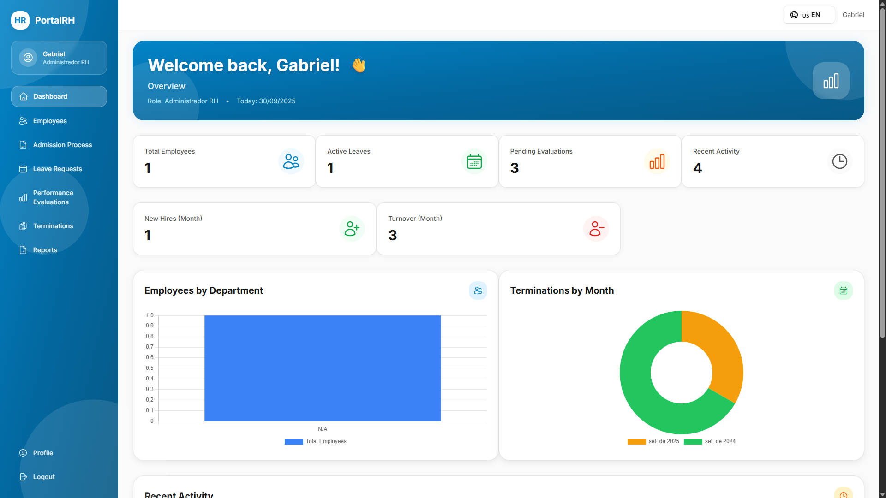
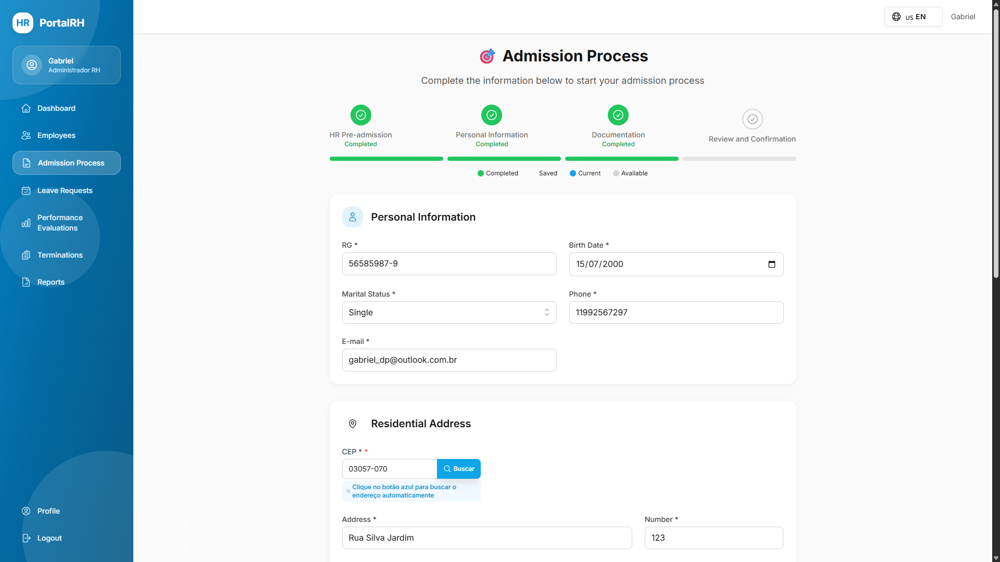
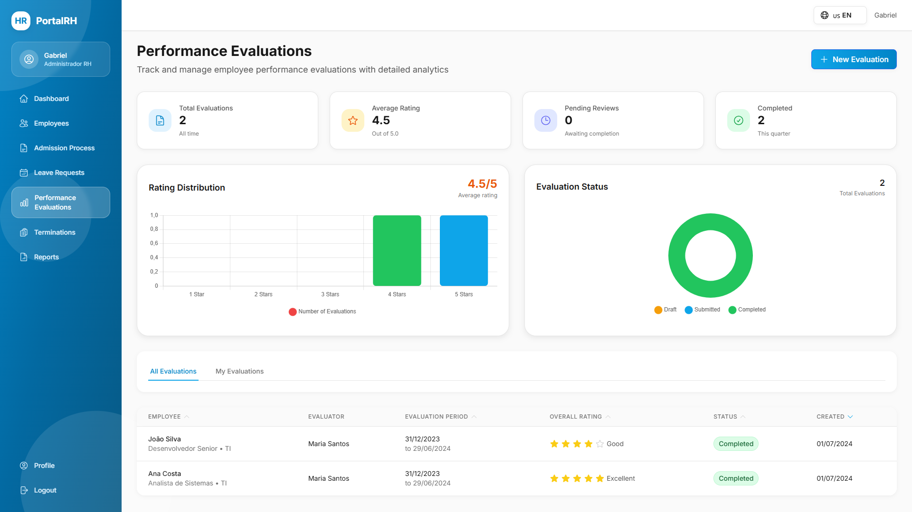
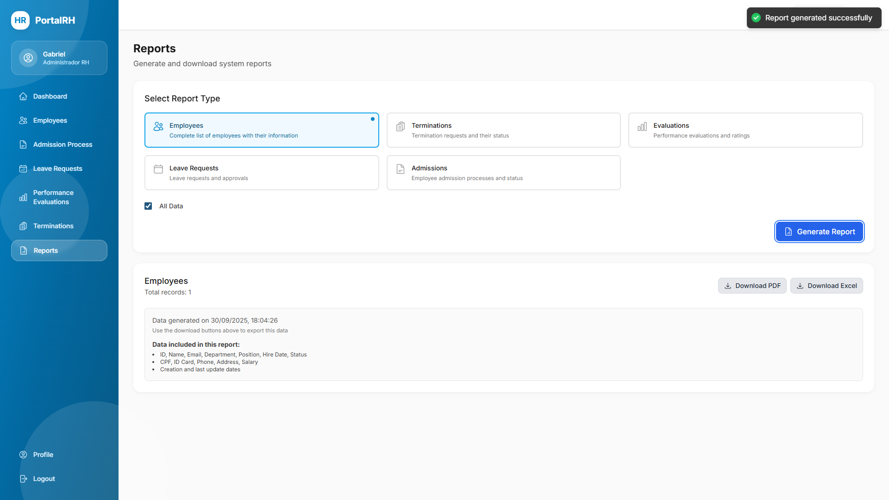

# Project Images

This page centralizes the current UI component screenshots used in PortalRH.

## Component 01

## Component 02

## Component 03

## Component 04

## Component 05

## Component 06

## Component 07

## Component 08

## Component 09

## Component 10

## Component 11

## Component 12

## Component 13

## Component 14

## Component 15

