# System Modeling

This document provides comprehensive system modeling including data models, architecture diagrams, and workflow visualizations.

---

## 📊 Entity Relationship Diagram (ERD)

```mermaid
erDiagram
    ACCOUNTS_USER ||--o| EMPLOYEES_EMPLOYEE : has_profile
    ACCOUNTS_USER ||--o| LEAVE_REQUESTS_LEAVE_REQUEST : submits
    ACCOUNTS_USER ||--o| EVALUATIONS_EVALUATION : evaluates
    ACCOUNTS_USER ||--o| TERMINATION_TERMINATION_REQUEST : requests
    ACCOUNTS_USER ||--o| REPORTS_REPORT_EXECUTION : executes
    
    EMPLOYEES_EMPLOYEE ||--o| EMPLOYEES_EMPLOYEE_DOCUMENT : has_documents
    EMPLOYEES_EMPLOYEE ||--o| EMPLOYEES_ADMISSION_PROCESS : has_process
    EMPLOYEES_EMPLOYEE ||--o| STAFF_EMPLOYEE : works_as
    
    LEAVE_REQUESTS_LEAVE_TYPE ||--o| LEAVE_REQUESTS_LEAVE_REQUEST : defines
    LEAVE_REQUESTS_LEAVE_REQUEST ||--o| LEAVE_REQUESTS_LEAVE_BALANCE : affects
    
    EVALUATIONS_EVALUATION_TEMPLATE ||--o| EVALUATIONS_EVALUATION_CRITERIA : contains
    EVALUATIONS_EVALUATION_TEMPLATE ||--o| EVALUATIONS_EVALUATION : used_in
    EVALUATIONS_EVALUATION ||--o| EVALUATIONS_EVALUATION_SCORE : contains
    EVALUATIONS_EVALUATION_CYCLE ||--o| EVALUATIONS_CYCLE_PARTICIPANT : includes
    
    TERMINATION_TERMINATION_REASON ||--o| TERMINATION_TERMINATION_REQUEST : defines
    TERMINATION_TERMINATION_REQUEST ||--o| TERMINATION_TERMINATION_DOCUMENT : generates
    
    REPORTS_REPORT_TEMPLATE ||--o| REPORTS_REPORT_EXECUTION : executed_as
    REPORTS_REPORT_TEMPLATE ||--o| REPORTS_REPORT_SCHEDULE : scheduled_as
    REPORTS_REPORT_CATEGORY ||--o| REPORTS_REPORT_TEMPLATE : categorizes
    
    STAFF_DEPARTMENT ||--o{ STAFF_EMPLOYEE : contains
```

---

## 🏗️ System Architecture

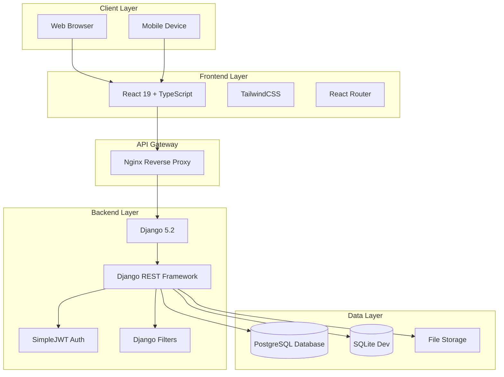

---

## 🔐 Authentication Flow

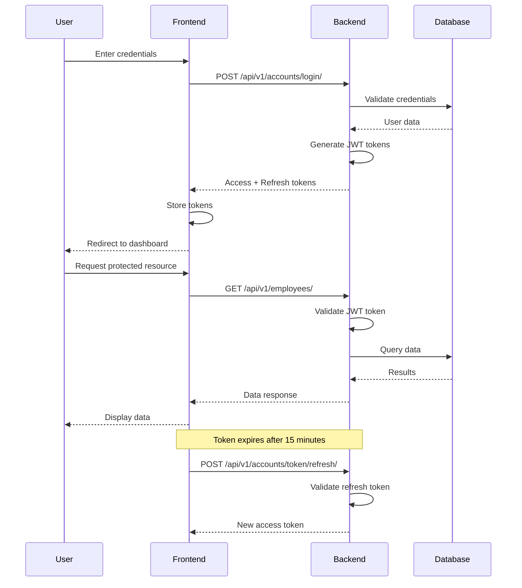

---

## 📝 CRUD Operations Flow

### Employee Management CRUD

```mermaid
graph LR
    subgraph Create
        A1[HR Admin] --> A2[Fill Employee Form]
        A2 --> A3[POST /api/v1/employees/]
        A3 --> A4[Validate Data]
        A4 --> A5[Save to Database]
        A5 --> A6[Return Employee]
    end
    
    subgraph Read
        B1[User] --> B2[GET /api/v1/employees/]
        B2 --> B3[Apply Filters]
        B3 --> B4[Query Database]
        B4 --> B5[Serialize Data]
        B5 --> B6[Return List]
    end
    
    subgraph Update
        C1[HR Admin] --> C2[Edit Employee Data]
        C2 --> C3[PUT /api/v1/employees/{id}/]
        C3 --> C4[Validate Changes]
        C4 --> C5[Update Database]
        C5 --> C6[Return Updated]
    end
    
    subgraph Delete
        D1[HR Admin] --> D2[Confirm Delete]
        D2 --> D3[DELETE /api/v1/employees/{id}/]
        D3 --> D4[Soft Delete]
        D4 --> D5[Return 204]
    end
```

### Leave Request Workflow

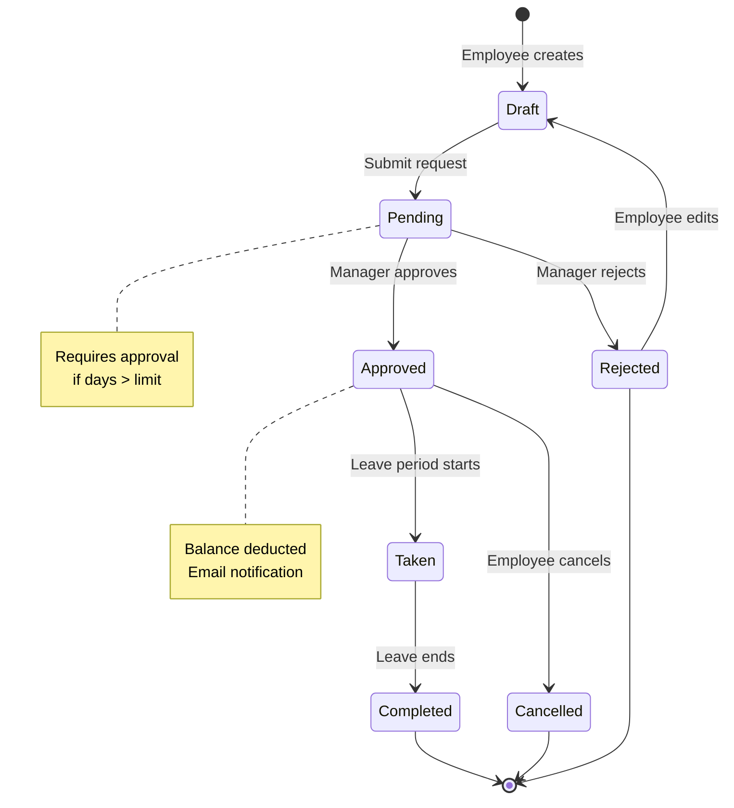

### Evaluation Process Flow

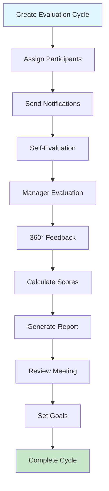

### Termination Process Flow

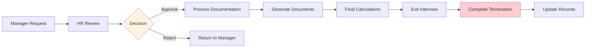

---

## 🔒 Security Architecture

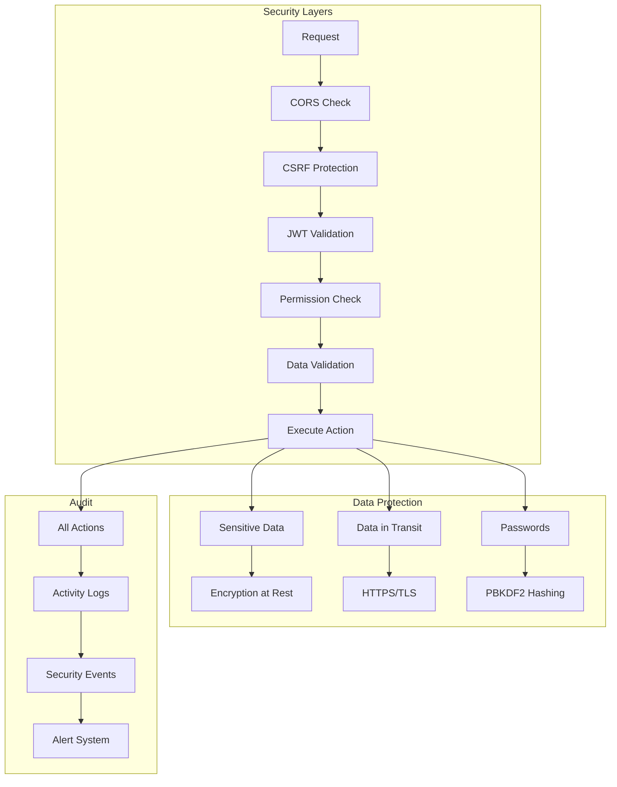

---

## 📦 Component Architecture

### Backend Component Diagram

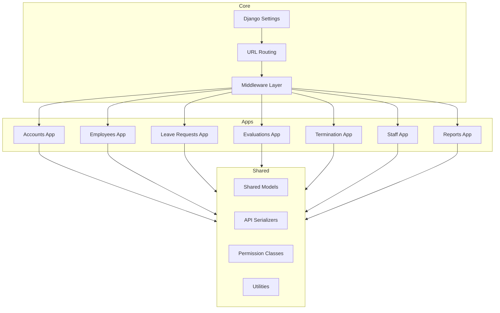

### Frontend Component Hierarchy

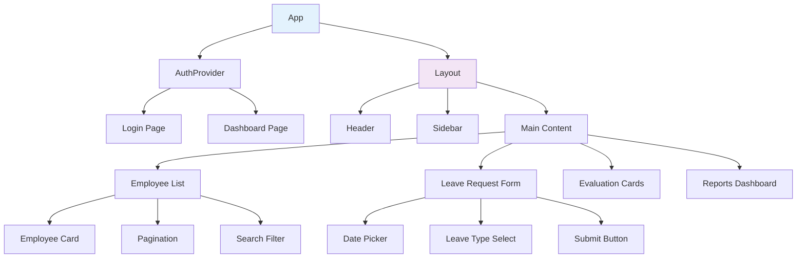

---

## 🔄 State Management

### Frontend State Flow

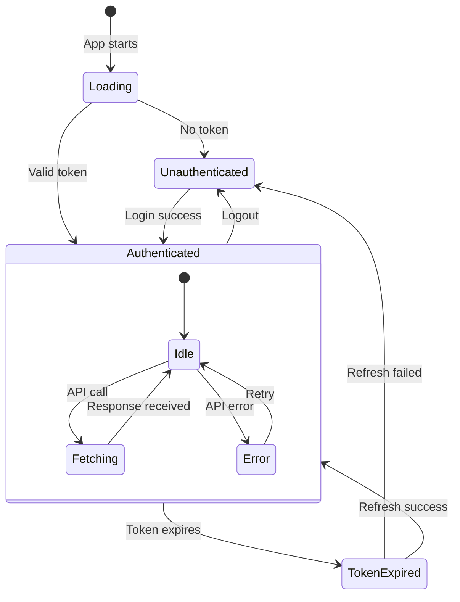

---

## 📊 Database Schema Details

### User & Authentication

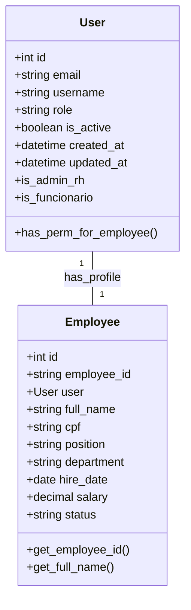

### Leave Management

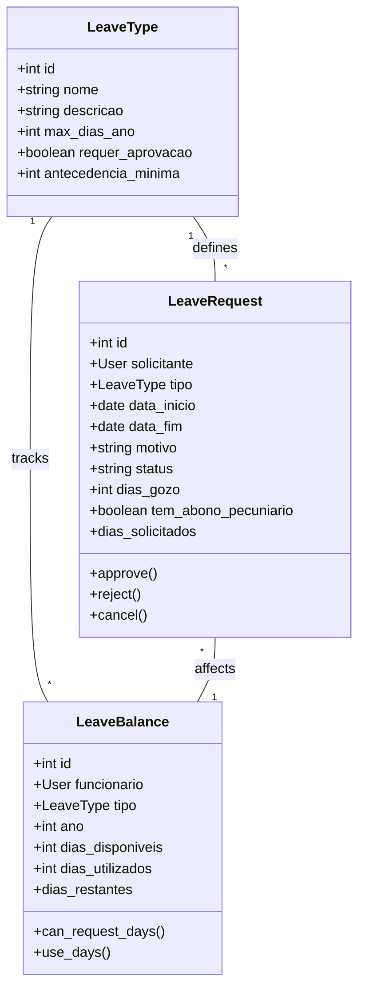

### Evaluations

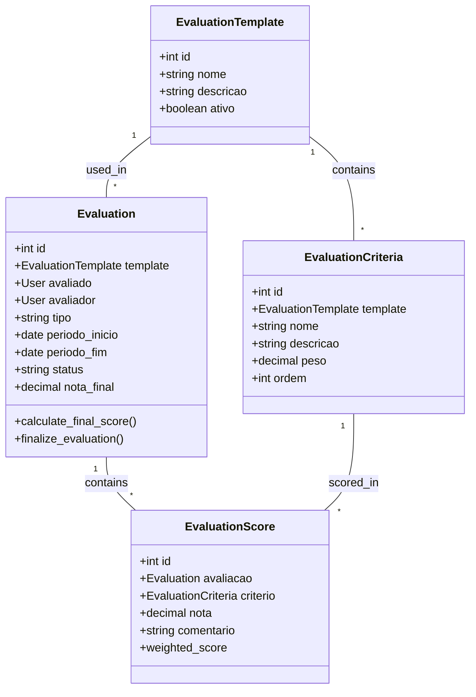

---

## 🌐 Deployment Architecture

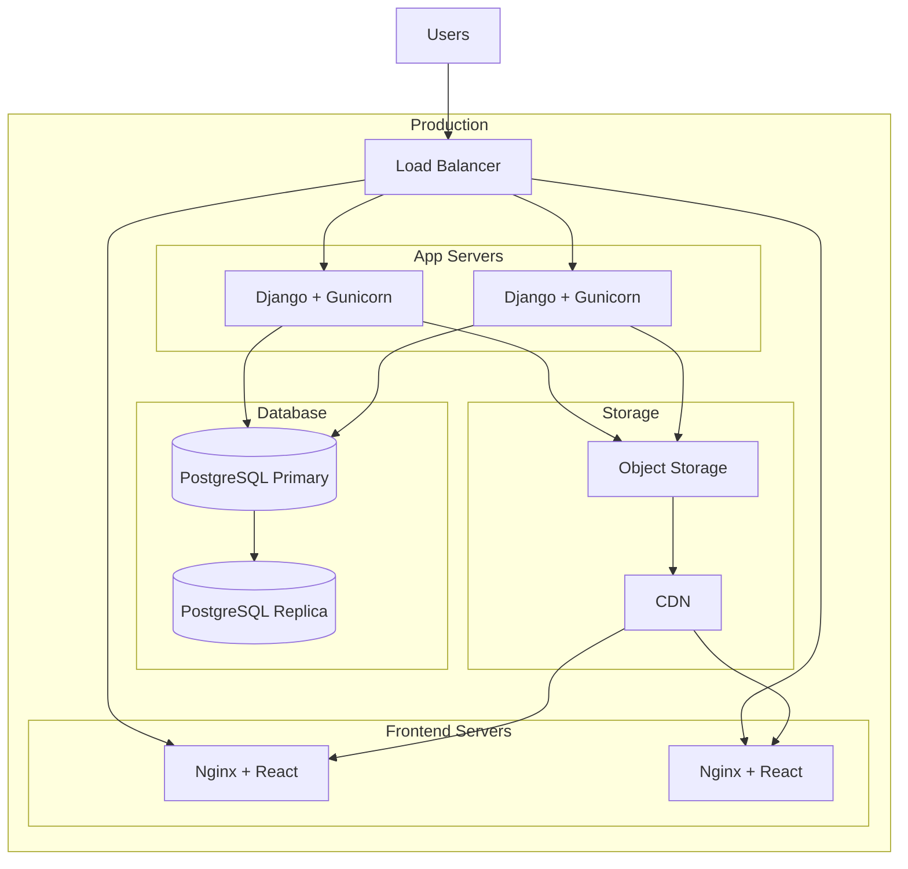

---

## 📈 Performance Architecture

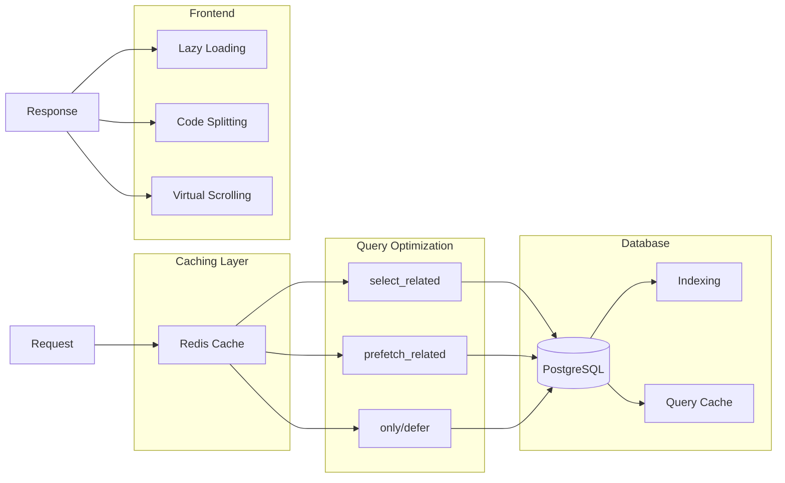

---

## 🔄 Integration Points

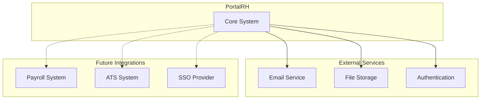

---

## 📱 User Interface Flow

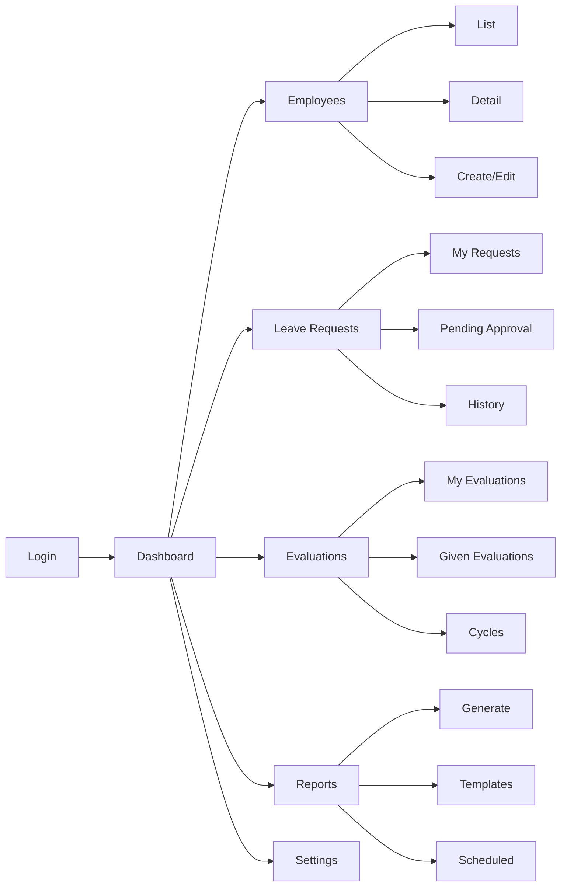

---

## 📚 Related Documentation

- [API Endpoints](api-endpoints.md) - API reference
- [Authentication](authentication.md) - Security details
- [Development Guide](development.md) - Implementation guide

---

## 🎯 Key Design Decisions

### Database Design

- **Custom User Model:** Extended AbstractUser for role-based access
- **One-to-One Relationships:** Employee profiles linked to users
- **Soft Deletes:** Preserve historical data
- **Audit Fields:** created_at, updated_at on all models

### API Design

- **RESTful:** Resource-based endpoints
- **Versioning:** URL-based versioning (/api/v1/)
- **Pagination:** Standard pagination for lists
- **Filtering:** Django Filters for complex queries

### Security Design

- **JWT Authentication:** Stateless token-based auth
- **Role-Based Access:** Two-tier role system
- **Input Validation:** Serializer validation
- **CORS:** Strict origin policy

---

## 🆘 Diagram Legend

| Symbol | Meaning |
|--------|---------|
| `||--o{` | One-to-many relationship |
| `||--||` | One-to-one relationship |
| `o{--o{` | Many-to-many relationship |
| `-->` | Data flow direction |
| `-.->` | Optional/future integration |
| `[]` | Component/Service |
| `[()]` | Database |
