# System Modeling

This document covers the data models, system architecture, and workflow diagrams for PortalRH.

---

## 📊 Data Models (ERD)

```mermaid
erDiagram
    %% Accounts Module
    USER {
        int id PK
        string email UK
        string role "admin_rh, funcionario"
        boolean is_active
        datetime created_at
        datetime updated_at
    }

    %% Employees Module
    PRE_ADMISSION_RH {
        int id PK
        string personal_email UK
        string full_name
        string position
        string department
        text job_description
        string work_schedule
        string weekly_workload "20h, 30h, 40h, 44h"
        string contract_type "clt, temporary, internship, freelancer, pj"
        decimal salary
        text benefits
        date start_date
        text vacation_policy
        string direct_manager
        int created_by FK
        boolean employee_user_created
        string temporary_password
        boolean email_sent
        int employee_id FK
        datetime created_at
        datetime updated_at
    }

    EMPLOYEE {
        int id PK
        string employee_id UK "EMP-XXXX"
        int user_id FK
        string full_name
        string cpf UK
        string rg
        date birth_date
        string marital_status
        string phone
        string email
        string street_address
        string address_number
        string neighborhood
        string city
        string state
        string zip_code
        string pis_pasep
        string work_card_number
        string work_card_series
        string education_level
        string bank_name
        string agency_number
        string account_number
        string account_type
        string department
        string position
        date hire_date
        decimal salary
        string status "pending, under_review, approved, active, inactive"
        boolean admission_completed
        boolean requires_password_change
        datetime created_at
        datetime updated_at
    }

    EMPLOYEE_DOCUMENT {
        int id PK
        int employee_id FK
        string document_type "rg, birth_certificate, work_card, etc."
        string document_name
        string file
        int file_size
        datetime uploaded_at
        boolean is_required
        boolean is_verified
    }

    ADMISSION_PROCESS {
        int id PK
        int employee_id FK
        string status "started, documents_uploaded, under_review, approved, completed"
        datetime started_at
        datetime completed_at
        text notes
        boolean personal_info_completed
        boolean documents_uploaded
        boolean hr_review_completed
    }

    %% Evaluations Module
    EVALUATION_TEMPLATE {
        int id PK
        string nome UK
        text descricao
        boolean ativo
        datetime created_at
        datetime updated_at
    }

    EVALUATION_CRITERIA {
        int id PK
        int template_id FK
        string nome
        text descricao
        decimal peso
        int ordem
        datetime created_at
    }

    EVALUATION {
        int id PK
        int template_id FK
        int avaliado_id FK
        int avaliador_id FK
        string tipo
        date periodo_inicio
        date periodo_fim
        string status
        decimal nota_final
        text comentario_geral
        text pontos_fortes
        text pontos_melhoria
        text metas_objetivos
        datetime data_limite
        datetime data_conclusao
        datetime created_at
        datetime updated_at
    }

    EVALUATION_SCORE {
        int id PK
        int avaliacao_id FK
        int criterio_id FK
        decimal nota
        text comentario
        datetime created_at
        datetime updated_at
    }

    EVALUATION_CYCLE {
        int id PK
        string nome
        text descricao
        date data_inicio
        date data_fim
        int template_id FK
        string status
        int created_by FK
        datetime created_at
        datetime updated_at
    }

    EVALUATION_CYCLE_PARTICIPANT {
        int id PK
        int cycle_id FK
        int funcionario_id FK
        int avaliador_id FK
        datetime data_limite
        boolean concluido
        datetime created_at
    }

    %% Leave Requests Module
    LEAVE_TYPE {
        int id PK
        string nome UK
        text descricao
        int max_dias_ano
        boolean requer_aprovacao
        int antecedencia_minima
        boolean ativo
        datetime created_at
        datetime updated_at
    }

    LEAVE_REQUEST {
        int id PK
        int solicitante_id FK
        int tipo_id FK
        date data_inicio
        date data_fim
        text motivo
        text observacoes
        int dias_gozo
        boolean tem_abono_pecuniario
        int dias_abono_pecuniario
        string prioridade
        string status
        int aprovador_id FK
        datetime data_aprovacao
        text comentario_aprovacao
        string anexo
        datetime created_at
        datetime updated_at
    }

    LEAVE_BALANCE {
        int id PK
        int funcionario_id FK
        int tipo_id FK
        int ano
        int dias_disponiveis
        int dias_utilizados
        datetime created_at
        datetime updated_at
    }

    %% Reports Module
    REPORT_CATEGORY {
        int id PK
        string name UK
        text description
        string icon
        string color
        boolean is_active
        datetime created_at
        datetime updated_at
    }

    REPORT_TEMPLATE {
        uuid id PK
        string name
        text description
        string report_type
        int category_id FK
        json query_config
        json output_formats
        string default_format
        json columns_config
        json chart_config
        boolean is_public
        json allowed_roles
        int cache_duration
        boolean enable_cache
        boolean is_active
        int version
        datetime created_at
        datetime updated_at
    }

    REPORT_EXECUTION {
        uuid id PK
        uuid template_id FK
        int executed_by FK
        json parameters
        string output_format
        string status
        json result_data
        string file_path
        float execution_time_seconds
        int rows_processed
        text error_message
        datetime started_at
        datetime completed_at
        datetime expires_at
        datetime created_at
        datetime updated_at
    }

    REPORT_SCHEDULE {
        uuid id PK
        string name
        uuid template_id FK
        string frequency
        string cron_expression
        string output_format
        json parameters
        json email_recipients
        boolean send_email_on_success
        boolean send_email_on_failure
        string status
        datetime last_execution
        datetime next_execution
        int execution_count
        int success_count
        int failure_count
        datetime created_at
        datetime updated_at
    }

    REPORT_BOOKMARK {
        int id PK
        int user_id FK
        uuid template_id FK
        string name
        json parameters
        datetime created_at
        datetime updated_at
    }

    %% Staff Module
    STAFF_EMPLOYEE {
        int id PK
        int user_id FK
        string nome
        string cargo
        string setor
        date data_admissao
        date data_demissao
        decimal salario
        string cpf UK
        string rg
        string telefone
        text endereco
        date data_nascimento
        string status
        text observacoes
        string foto
        datetime created_at
        datetime updated_at
    }

    DEPARTMENT {
        int id PK
        string nome UK
        text descricao
        datetime created_at
        datetime updated_at
    }

    STAFF_EMPLOYEE_DOCUMENT {
        int id PK
        int employee_id FK
        string tipo
        string nome
        string arquivo
        text descricao
        int uploaded_by FK
        datetime created_at
    }

    %% Termination Module
    TERMINATION_REASON {
        int id PK
        string nome UK
        string codigo UK
        text descricao
        boolean ativo
        datetime created_at
        datetime updated_at
    }

    TERMINATION_REQUEST {
        int id PK
        int funcionario_id FK
        int solicitante_id FK
        int motivo_id FK
        date data_ultimo_dia
        date data_desligamento
        text justificativa
        text observacoes_rh
        string status
        int aprovador_rh_id FK
        datetime data_aprovacao_rh
        text comentario_aprovacao_rh
        string anexo_documentos
        datetime created_at
        datetime updated_at
    }

    TERMINATION_DOCUMENT {
        int id PK
        int termination_request_id FK
        string tipo_documento
        string nome_arquivo
        string arquivo
        boolean gerado_automaticamente
        int gerado_por FK
        text observacoes
        datetime created_at
        datetime updated_at
    }

    %% Relationships
    USER ||--o| EMPLOYEE : "has profile (employee_profile)"
    USER ||--o{ EVALUATION : "evaluates/is evaluated"
    USER ||--o{ LEAVE_REQUEST : "requests/approves"
    USER ||--o{ REPORT_EXECUTION : "executes"
    USER ||--o| STAFF_EMPLOYEE : "staff profile"
    USER ||--o{ REPORT_BOOKMARK : "bookmarks"
    USER ||--o{ REPORT_TEMPLATE : "creates/allowed"
    USER ||--o{ REPORT_SCHEDULE : "creates"
    USER ||--o{ TERMINATION_REQUEST : "requests/approves"
    USER ||--o{ PRE_ADMISSION_RH : "creates"

    PRE_ADMISSION_RH }o--|| USER : "created by"
    PRE_ADMISSION_RH ||--o| EMPLOYEE : "creates (OneToOne)"
    
    EMPLOYEE ||--o{ EMPLOYEE_DOCUMENT : "has documents"
    EMPLOYEE ||--o| ADMISSION_PROCESS : "has process"
    
    EVALUATION_TEMPLATE ||--o{ EVALUATION_CRITERIA : "contains"
    EVALUATION_TEMPLATE ||--o{ EVALUATION : "used in"
    EVALUATION_TEMPLATE ||--o{ EVALUATION_CYCLE : "used in"
    
    EVALUATION ||--o{ EVALUATION_SCORE : "has scores"
    EVALUATION_CRITERIA ||--o{ EVALUATION_SCORE : "has scores"
    
    EVALUATION_CYCLE ||--o{ EVALUATION_CYCLE_PARTICIPANT : "has participants"
    USER ||--o{ EVALUATION_CYCLE_PARTICIPANT : "participates"
    
    LEAVE_TYPE ||--o{ LEAVE_REQUEST : "categorizes"
    LEAVE_TYPE ||--o{ LEAVE_BALANCE : "tracks balance"
    
    USER ||--o{ LEAVE_REQUEST : "requests"
    USER ||--o{ LEAVE_BALANCE : "has balance"
    
    REPORT_CATEGORY ||--o{ REPORT_TEMPLATE : "categorizes"
    REPORT_TEMPLATE ||--o{ REPORT_EXECUTION : "executed as"
    REPORT_TEMPLATE ||--o{ REPORT_SCHEDULE : "scheduled as"
    REPORT_TEMPLATE ||--o{ REPORT_BOOKMARK : "bookmarked as"
    
    DEPARTMENT ||--o{ STAFF_EMPLOYEE : "employs"
    STAFF_EMPLOYEE ||--o{ STAFF_EMPLOYEE_DOCUMENT : "has documents"
    
    TERMINATION_REASON ||--o{ TERMINATION_REQUEST : "categorizes"
    TERMINATION_REQUEST ||--o{ TERMINATION_DOCUMENT : "has documents"
    USER ||--o{ TERMINATION_REQUEST : "requests/approves"
```

---

## 🏗️ System Architecture

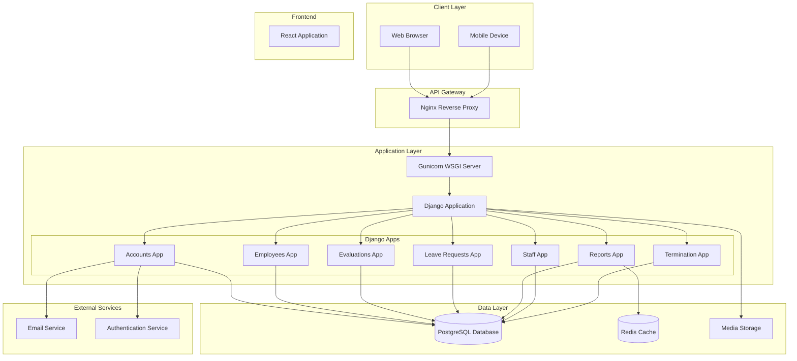

---

## 🔐 Authentication Flow

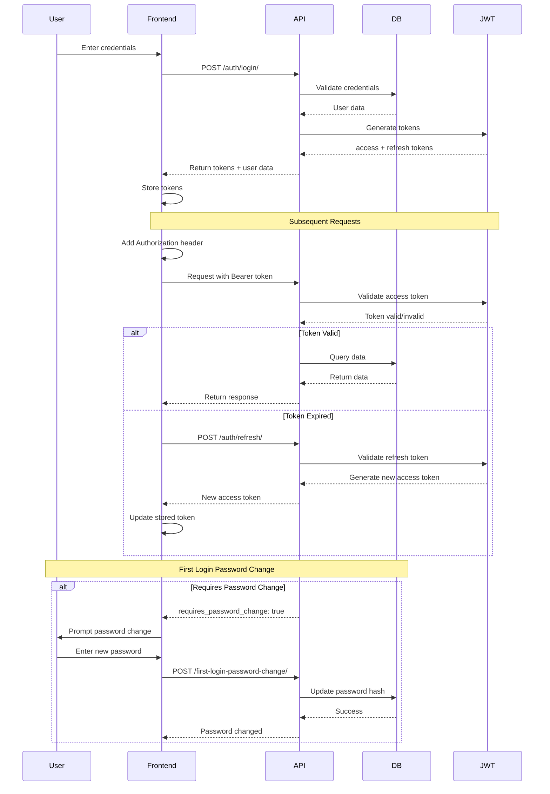

---

## 📝 CRUD Operations Flow

### Employee Management

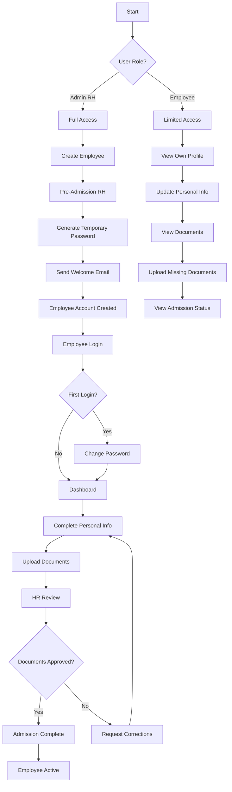

### Leave Request Flow

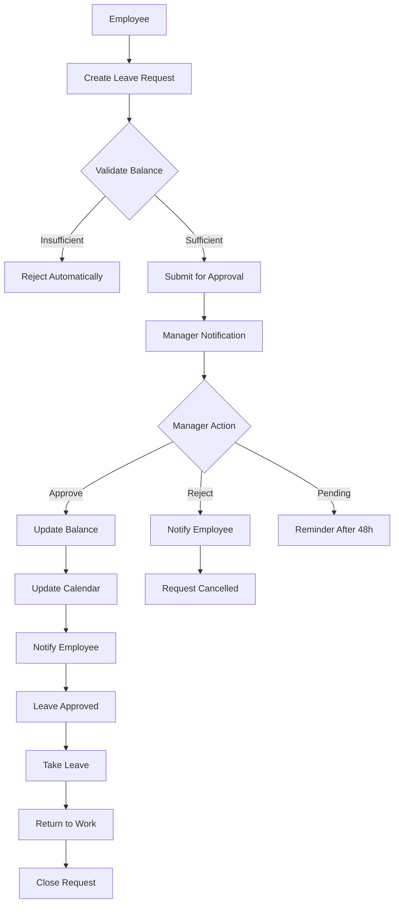

### Performance Evaluation Flow

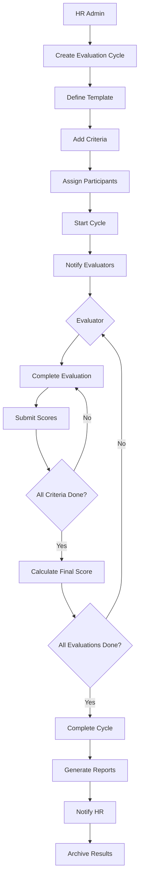

### Termination Flow

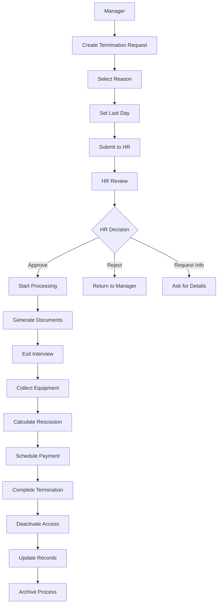

---

## 🔒 Security Flow

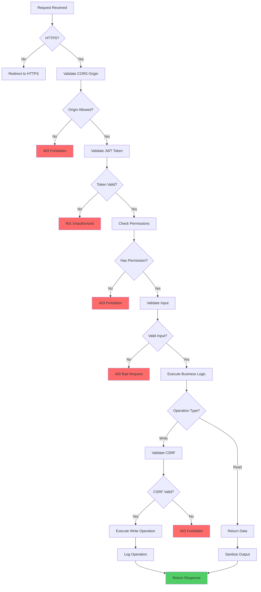

---

## 📊 Module Interactions

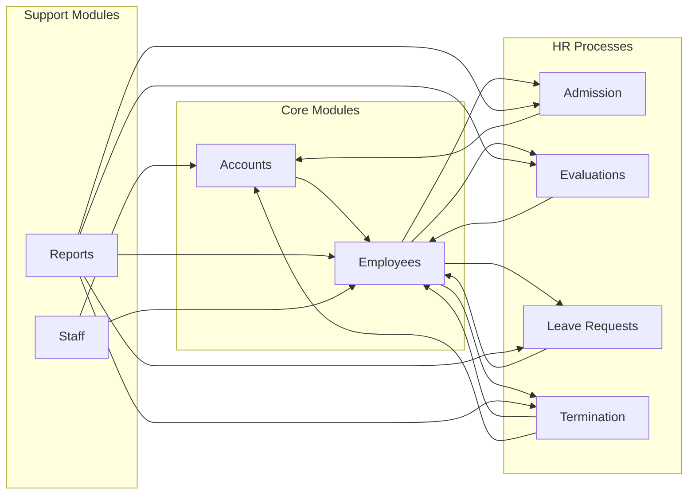

---

## 📈 Data Flow Diagram

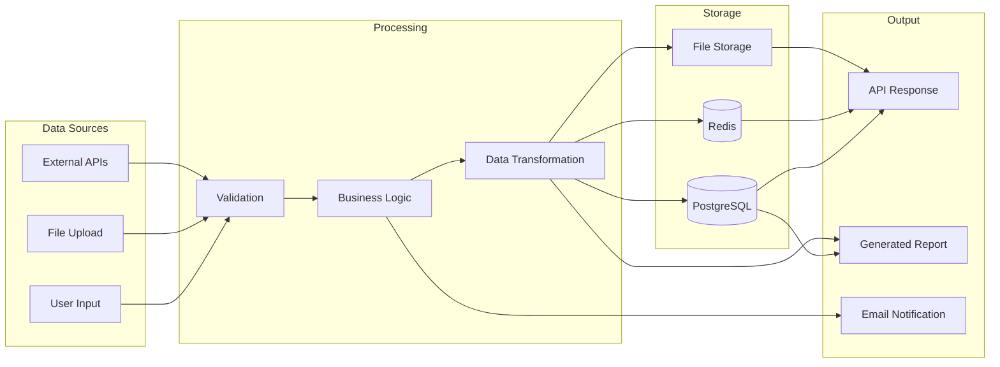

---

## 🔄 State Machines

### Employee Status

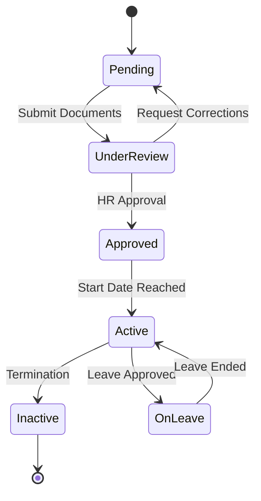

### Leave Request Status

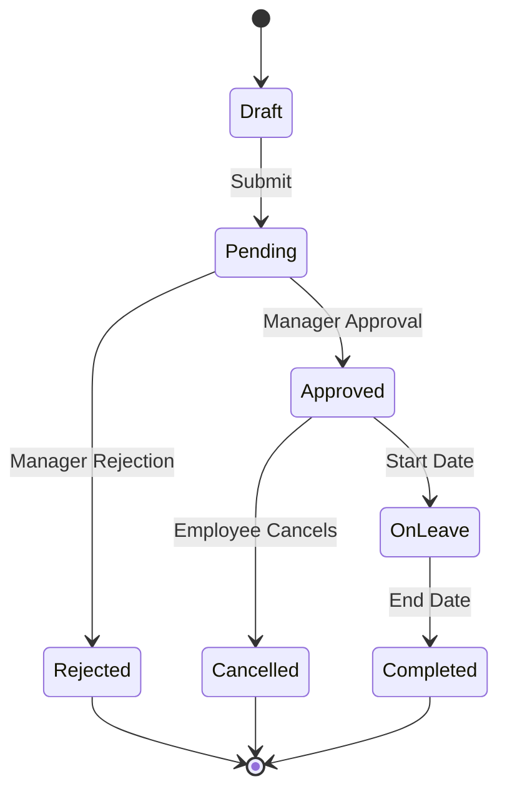

### Evaluation Status

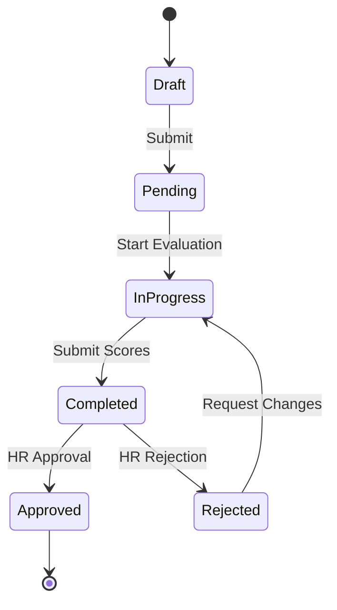

### Termination Status

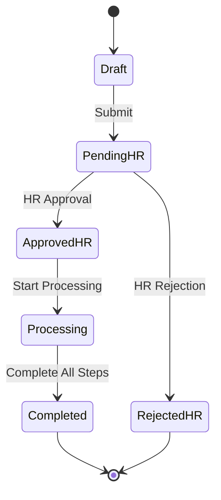

---

**Next:** [Authentication & Security](authentication-security.md)
